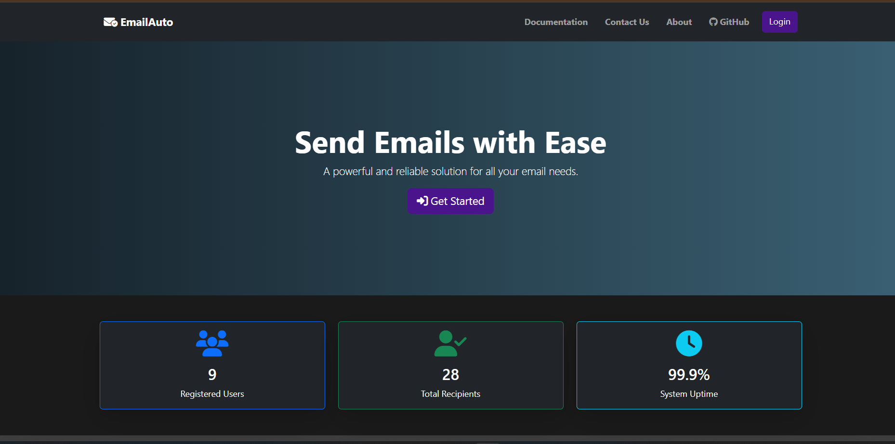
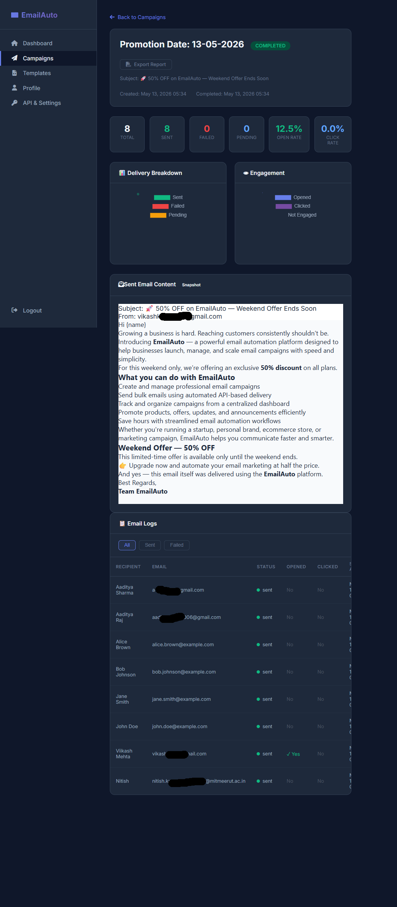
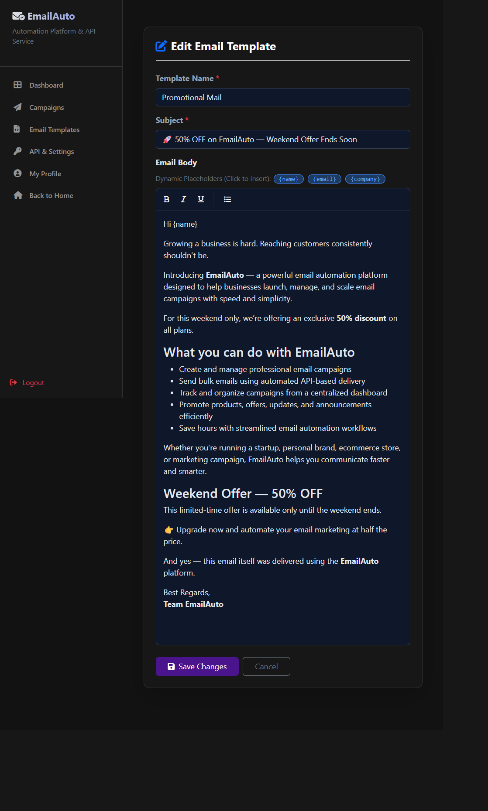
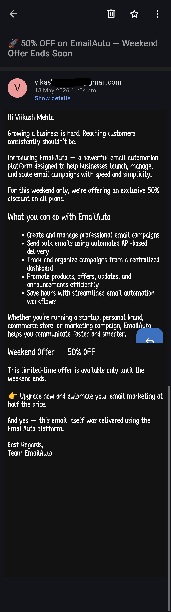
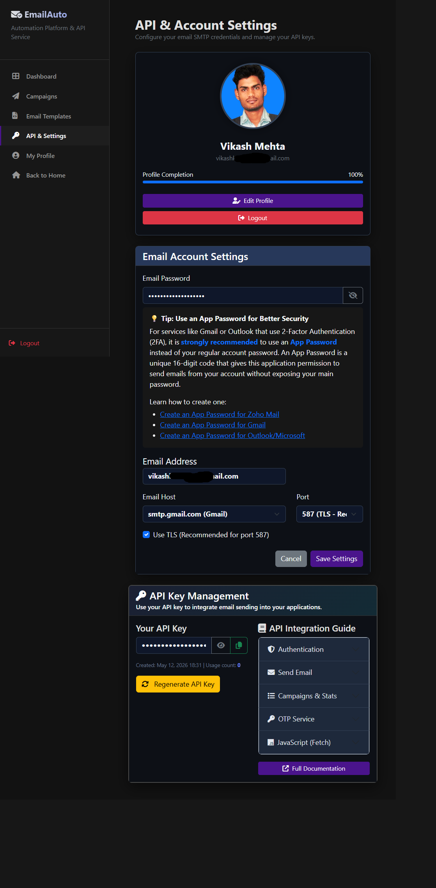

# 📧 EmailAuto: Enterprise-Grade Email Automation & API Ecosystem

[](https://www.python.org)
[](https://www.djangoproject.com)
[](LICENSE)

**EmailAuto** is a robust, full-stack email marketing and developer-centric automation platform. It bridges the gap between simple email scripts and complex enterprise SaaS by offering high-concurrency multi-threading, deep engagement analytics, and a powerful REST API for seamless integration.

---

## 📑 Table of Contents
1. [Executive Summary](#-executive-summary)
2. [Feature Deep-Dive](#-feature-deep-dive)
3. [System Architecture](#-system-architecture)
4. [Data Model & Relationships](#-data-model--relationships)
5. [Internal Workflow & Logic](#-internal-workflow--logic)
6. [API Documentation](#-api-documentation)
7. [Installation & Deployment](#-installation--deployment)
8. [Comprehensive Screenshots Guide](#-comprehensive-screenshots-guide)

---

## 🚀 Executive Summary

EmailAuto is designed for developers and businesses that require **control**, **speed**, and **intelligence**. Unlike standard tools, it allows for custom SMTP rotation, provides raw engagement data, and handles thousands of recipients without blocking the user interface.

---

## 💎 Feature Deep-Dive

### 📡 Multi-Threaded Campaign Engine
The heart of the platform is a dynamic threading engine that optimizes itself based on the workload:
*   **Dynamic Scaling**: For lists larger than 10, the system automatically spawns up to 5 concurrent threads.
*   **Asynchronous Backgrounding**: All campaigns are moved to a background worker immediately upon initiation. This prevents request timeouts and allows the user to navigate the site while sending occurs.
*   **SMTP Connection Pooling**: Reuses connections across threads to minimize the handshake overhead with providers like Gmail or Outlook.

### 📊 Engagement Intelligence
*   **Zero-Latency Tracking**: Tracking links and pixels are processed in milliseconds to ensure zero impact on recipient load times.
*   **Link Rewriting Engine**: A custom regex-based parser that identifies all `<a>` tags in your HTML and wraps them in unique tracking redirects.
*   **Open Rate Analysis**: Uses 1x1 transparent GIF injection to detect "Seen" status.

### 🧠 Smart Data Intake
*   **Heuristic Column Detection**: Our Pandas-powered engine scans column content to find email addresses and names, even if the file has no headers.
*   **Bulk Operations**: Support for `.csv`, `.xls`, and `.xlsx` with automatic duplicate detection and data sanitization.

---

## 🏗️ System Architecture

The platform follows a modular **Service-Oriented Architecture (SOA)**:

| Module | Responsibility |
| :--- | :--- |
| **`services/email_service.py`** | Handles threading, SMTP logic, and campaign orchestration. |
| **`tracking/`** | Handles incoming pixel hits and link redirects. |
| **`api/`** | Exposes core functionality to external developers via REST. |
| **`campaigns/`** | Stores snapshots of sent content, stats, and recipient logs. |

---

## 🧬 Data Model & Relationships

The database is designed with a hierarchical relationship to ensure data integrity and trackability.

### Entity Relationship Overview:
1.  **`emailUsers` (The Center)**:
    *   `1 : N` with `Receipent_Group`: A user can have multiple groups.
    *   `1 : N` with `Template`: A user can design multiple email templates.
    *   `1 : N` with `Campaign`: A user can launch many campaigns.
2.  **`Receipent_Group`**:
    *   `1 : N` with `Receipent`: A group contains many recipients.
3.  **`Campaign`**:
    *   `1 : N` with `EmailLog`: Each campaign generates a log for every recipient it targeted.
4.  **`EmailLog`**:
    *   `1 : 1` link to a unique tracking UUID for open/click events.

### Database Connection Philosophy:
While the project currently uses **SQLite** for development (zero-config), the models are written using **Django ORM**, making it "DB Agnostic." You can switch to **PostgreSQL** or **MySQL** by simply updating the `DATABASES` setting in `settings.py`. All complex queries (like analytics aggregation) use Django's `F` expressions and `Count` aggregates to ensure performance across different database engines.

---

## 🔄 Internal Workflow & Logic

### 1. The Sending Lifecycle
1.  **Request**: User selects a group and template.
2.  **Snapshot**: The system takes a "Content Snapshot" of the template (Subject/Body).
3.  **Log Generation**: `EmailLog` records are pre-generated in a `Pending` state.
4.  **Distribution**: The `ThreadPoolExecutor` picks up tasks. Each thread handles its own placeholders (`{{name}}`, etc.).
5.  **Tracking**: As emails are opened/clicked, the `tracking` app updates logs in real-time.

---

## 🔌 API Documentation

### Authentication
Include your API Key in the header: `X-API-KEY: your_generated_key`

### Endpoint: Send Bulk Email
`POST /api/v1/send-bulk/`
```json
{
  "template_id": 12,
  "recipient_ids": [101, 102, 103],
  "campaign_name": "Product Launch"
}
```

---

## 📸 Comprehensive Screenshots Guide

*To complete this README, replace the text below with actual images.*

### 1. Unified Dashboard
> 
> *Key View: Global analytics charts and quick-action buttons.*

### 2. Campaign Deep-Dive & Tracking
> 
> *Key View: Real-time progress bars and engagement metrics.*


### 3. Template Editor & Personalization
> 
> *Key View: Designing responsive HTML templates.*

### 4. Sent Content Snapshot
> 
> *Key View: Proof of exactly what was delivered to customers.*

### 5. API & SMTP Configuration
> 
> *Key View: Configuring Gmail/Zoho/Outlook credentials.*

---

## ⚙️ Installation

```bash
pip install -r requirements.txt
python manage.py migrate
python manage.py runserver
```

**© 2025 EmailAuto Platform. Optimized for performance and deliverability.**
