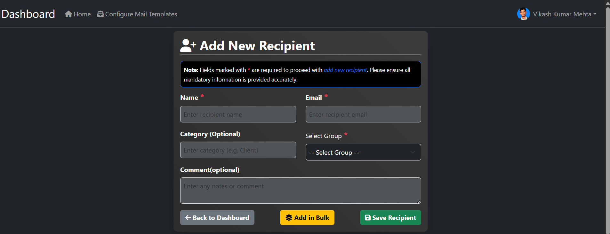
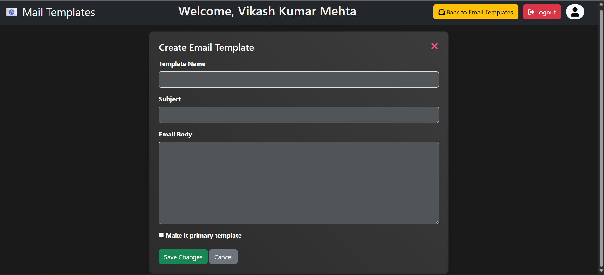
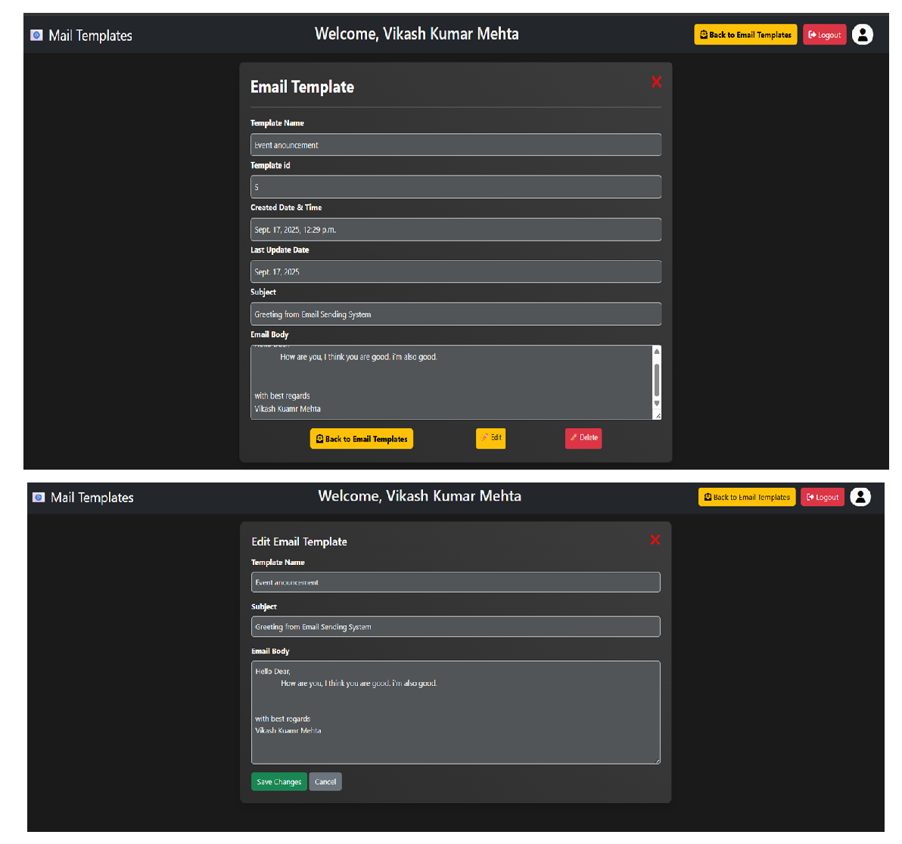

# Bulk Email Sending System

This is a Django-based web application for sending bulk emails. Users can sign up, manage their recipient lists, create email templates, and send emails to multiple recipients at once. This project is designed to be a simple and effective tool for small-scale email campaigns.

## Table of Contents

- [Project Status](#project-status)
- [Features](#features)
- [Screenshots](#screenshots)
- [Getting Started](#getting-started)
  - [Prerequisites](#prerequisites)
  - [Installation](#installation)
- [User Guide](#user-guide)
  - [User Authentication](#user-authentication)
    - [Sign Up](#sign-up)
    - [Login](#login)
    - [Logout](#logout)
    - [Forgot Password](#forgot-password)
    - [Reset Password](#reset-password)
  - [Dashboard](#dashboard)
  - [Profile Management](#profile-management)
    - [View Profile](#view-profile)
    - [Edit Profile](#edit-profile)
    - [Change Password](#change-password)
  - [Recipient Management](#recipient-management)
    - [Add Recipient](#add-recipient)
    - [View, Edit, and Delete Recipient](#view-edit-and-delete-recipient)
  - [Email Template Management](#email-template-management)
    - [Create Template](#create-template)
    - [View, Edit, and Delete Template](#view-edit-and-delete-template)
    - [Set Primary Template](#set-primary-template)
  - [Sending Bulk Emails](#sending-bulk-emails)
- [Future Improvements](#future-improvements)
- [Contributing](#contributing)
- [Developer Credits](#developer-credits)
- [License](#license)

## Project Status

**Under Development:** This project is currently under active development. New features are being added, and existing ones are being improved. Contributions are welcome!

**Live Now:** This project is live at: https://emailsender.pythonanywhere.com/

## Features

*   **User Authentication:** Secure user sign-up, login, and logout system.
*   **Profile Management:** Users can view and edit their profiles, including personal information and profile picture.
*   **Password Reset:** Secure password reset functionality using email verification.
*   **Recipient Management:** Users can add, view, edit, and delete their email recipients.
*   **Bulk Recipient Upload:** Add recipients in bulk using file uploads.
*   **Email Template Management:** Create, edit, and manage multiple email templates.
*   **Primary Template:** Set a default template for sending emails.
*   **Bulk Emailing:** Send emails to all registered recipients with a single click.
*   **SMTP Integration:** Uses SMTP to send emails, configured via environment variables.

## Screenshots

| Feature | Screenshot |
| :--- | :--- |
| Home Page |  |
| Sign Up Page |  |
| Login Page |  |
| Dashboard |  |
| Profile Page |  |
| Add Recipient Page |  |
| View/Delete Recipient Page |  |
| Add Template Page |  |
| View Template Page |  |
| Primary Template |  |
| Forgot Password Page |  |
| Reset Password Page |  |

## Getting Started

These instructions will get you a copy of the project up and running on your local machine for development and testing purposes.

### Prerequisites

*   Python 3.10 or higher
*   Pip (Python package installer)

### Installation

1.  **Clone the repository:**
    ```sh
    git clone https://github.com/Mehta-g1/Bulk-Email-Sending-System.git
    cd Bulk-Email-Sending-System
    ```

2.  **Create a virtual environment (recommended):**
    ```sh
    python -m venv .venv
    source .venv/bin/activate  # On Windows, use `.venv\Scripts\activate`
    ```

3.  **Install the dependencies:**
    ```sh
    pip install -r requirements.txt
    ```

4.  **Set up environment variables:**
    Create a `.env` file in the `Email` directory and add your email credentials:
    ```
    EMAIL_HOST_USER=your-email@gmail.com
    EMAIL_HOST_PASSWORD=your-app-password
    ```

5.  **Navigate to the project directory:**
    ```sh
    cd Email
    ```

6.  **Apply database migrations:**
    ```sh
    python manage.py migrate
    ```

7.  **Run the development server:**
    ```sh
    python manage.py runserver
    ```

The application will be available at `http://127.0.0.1:8000/`.

## User Guide

### User Authentication

#### Sign Up

1.  Navigate to the [Sign Up](http://127.0.0.1:8000/user/signUp/) page.
2.  Fill in the required details, including your name, email address, and password.
3.  Click the "Sign Up" button.


#### Login

1.  Navigate to the [Login](http://127.0.0.1:8000/user/login/) page.
2.  Enter your registered email address and password.
3.  Click the "Login" button.


#### Logout

1.  Click on the "Logout" button in the navigation bar.

#### Forgot Password

1.  Navigate to the [Forgot Password](http://127.0.0.1:8000/user/forgot-password/) page.
2.  Enter your registered email address.
3.  Click the "Submit" button. A password reset link will be sent to your email.


#### Reset Password

1.  Click on the reset password link sent to your email.
2.  Enter your new password and confirm it.
3.  Click the "Reset Password" button.


### Dashboard

After logging in, you will be redirected to the dashboard. The dashboard displays a list of your recipients and a search bar to find specific recipients.


### Profile Management

#### View Profile

1.  Click on your username in the navigation bar.
2.  Select "View Profile" from the dropdown menu.


#### Edit Profile

1.  On the View Profile page, click the "Edit Profile" button.
2.  Update your personal information.
3.  Click the "Save" button.


#### Change Password

1.  On the View Profile page, click the "Change Password" button.
2.  Enter your current password and the new password.
3.  Click the "Change Password" button.


### Recipient Management

#### Add Recipient (One by One)

1.  From the dashboard, click the "Add Recipients" button and select "One by One".
2.  Fill in the recipient's details (name, email, etc.) and select a group to assign them to.
3.  Click the "Save Recipient" button.

#### Add Recipients in Bulk (CSV/XLS)

1.  From the dashboard, click "Add Recipients" and select "Bulk (CSV/XLS)".
2.  Select a group to which all recipients from the file will be assigned.
3.  Choose your CSV or XLSX file. Ensure it follows the specified column format.
4.  Click "Upload".

#### View, Edit, and Delete

-   **View:** Click on the recipient's name on the dashboard to see their details.
-   **Edit:** On the recipient details page, click the "Edit" button. Update the information and click "Save".
-   **Delete:** On the recipient details page, click the "Delete" button.

### Email Template Management

#### Create Template

1.  Navigate to the [Templates](http://127.0.0.1:8000/user/templates/) page.
2.  Click the "Create New Template" button.
3.  Fill in the template name, subject, and body.
4.  Click the "Create" button.


#### View, Edit, and Delete Template

-   **View:** Click on the template name on the templates page to see its details.
-   **Edit:** On the template details page, click the "Edit" button. Update the information and click "Save".
-   **Delete:** On the template details page, click the "Delete" button.


#### Set Primary Template

1.  On the templates page, click the "Make Primary" button next to the desired template.


### Sending Bulk Emails

1.  From the dashboard, select the recipients you want to send an email to by checking the boxes next to their names.
2.  Click the "Send Email" button.


## Future Improvements

*   **Email Scheduling:** Implement a feature to schedule emails to be sent at a specific date and time.
*   **Analytics and Reporting:** Track email open rates, click-through rates, and other engagement metrics.
*   **Advanced User Roles:** Introduce different user roles and permissions (e.g., admin, user).
*   **Enhanced Security:** Implement two-factor authentication (2FA) for user accounts.

## Contributing

Pull requests are welcome! This project is open for contributions. If you have suggestions for improvements or want to add new features, please feel free to open an issue or submit a pull request.

1.  Fork the Project
2.  Create your Feature Branch (`git checkout -b feature/AmazingFeature`)
3.  Commit your Changes (`git commit -m 'Add some AmazingFeature'`)
4.  Push to the Branch (`git push origin feature/AmazingFeature`)
5.  Open a Pull Request

## Developer Credits

This project is maintained by:

*   **Vikash Kuamr Mehta** - *Initial Work*

We are grateful to all contributors who have helped and will help to improve this project.

## License

This project is licensed under the MIT License.