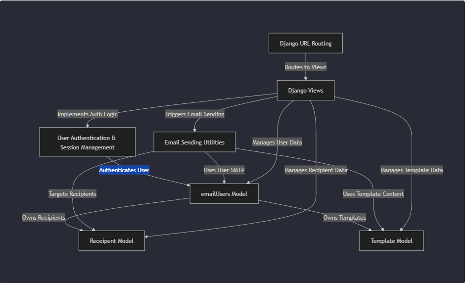
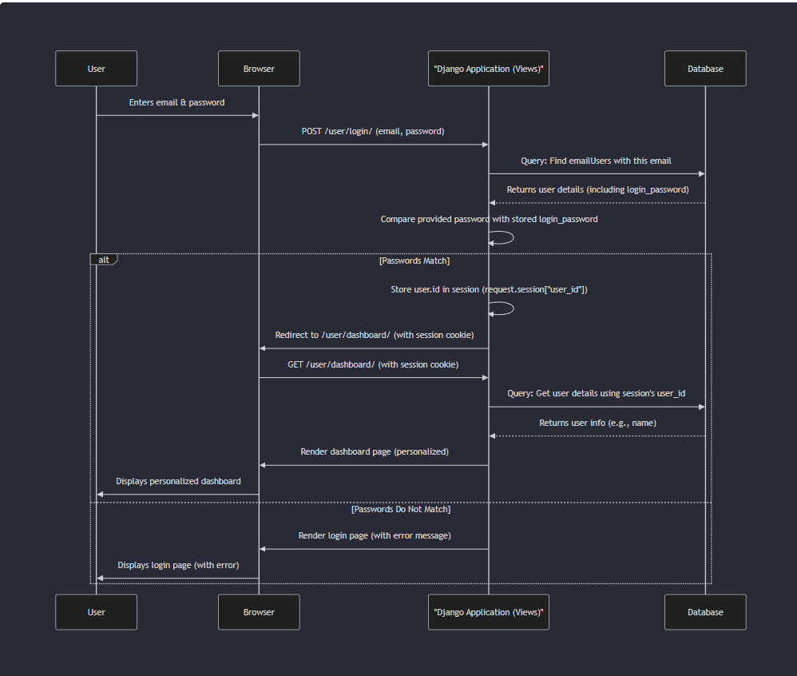

# Tutorial: Bulk-Email-Sending-System

This project is a **bulk email sending system** designed to help users *manage their email marketing efforts*. It allows users to store their own email sending account details, organize lists of recipients, and create reusable email templates. The system then efficiently sends personalized emails to selected recipients using the user's configured settings, simplifying mass communication.


## Visual Overview



## Table of Contents

- **[Chapter 1: User Authentication & Session Management](#chapter-1-user-authentication--session-management)**
  - [1.1 User Registration (Sign Up)](#1-user-registration-sign-up)
  - [1.2 User Login](#2-user-login)
  - [1.3 Session Management](#3-session-management)
  - [1.4 Logout](#4-logout)
  - [1.5 Password Reset](#5-password-reset)
  - [1.6 Password Hashing (A Security Note)](#6-password-hashing-a-security-note)
- **[Chapter 2: emailUsers Model](#chapter-2-emailusers-model)**
  - [2.1 Login & Basic Identification](#1-login--basic-identification)
  - [2.2 Email Sending Configuration (SMTP Details)](#2-email-sending-configuration-smtp-details)
  - [2.3 Professional / Designation Information](#3-professional--designation-information)
  - [2.4 Personal Information](#4-personal-information)
- **[Chapter 3: Receipent Model](#chapter-3-receipent-model)**
  - [3.1 The Owner (Sender)](#1-the-owner-sender)
  - [3.2 Core Contact Information](#2-core-contact-information)
  - [3.3 Organization & Notes](#3-organization--notes)
  - [3.4 Tracking Information](#4-tracking-information)
- **[Chapter 4: Template Model](#chapter-4-template-model)**
  - [4.1 The Owner (user)](#1-the-owner-user)
  - [4.2 The Email Content](#2-the-email-content)
  - [4.3 Status and Tracking](#3-status-and-tracking)
- **[Chapter 5: Django Views](#chapter-5-django-views)**
  - [5.1 It's a Python Function](#1-its-a-python-function)
  - [5.2 The `request` Object](#2-the-request-object)
  - [5.3 The `render()` Function (Showing HTML Pages)](#3-the-render-function-showing-html-pages)
  - [5.4 The `redirect()` Function (Sending Users to Another Page)](#4-the-redirect-function-sending-users-to-another-page)
- **[Chapter 6: Email Sending Utilities](#chapter-6-email-sending-utilities)**
  - [6.1 Getting Your Email Account's "Postal Details"](#1-getting-your-email-accounts-postal-details)
  - [6.2 Preparing the Email "Letter"](#2-preparing-the-email-letter)
  - [6.3 Gathering the "Addresses"](#3-gathering-the-addresses)
  - [6.4 The "Post Office Connection"](#4-the-post-office-connection)
  - [6.5 Sending the "Letter"](#5-sending-the-letter)
  - [6.6 Updating Our Records](#6-updating-our-records)
- **[Chapter 7: Django URL Routing](#chapter-7-django-url-routing)**
  - [7.1 URLs and Paths](#1-urls-and-paths)
  - [7.2 The `urlpatterns` List](#2-the-urlpatterns-list)
  - [7.3 The `path()` Function: Connecting Roads to Buildings (Views)](#3-the-path-function-connecting-roads-to-buildings-views)
  - [7.4 `include()`: Organizing Your Road Map by Neighborhood](#4-include-organizing-your-road-map-by-neighborhood)
  - [7.5 URL Parameters: Dynamic Addresses](#5-url-parameters-dynamic-addresses)
- **[Chapter 8: Deployment](#chapter-8-deployment)**
  - [8.1 PythonAnywhere](#1-pythonanywhere)


---


## Chapter 1: User Authentication & Session Management

Welcome to the **Bulk-Email-Sending-System** tutorial! In this first chapter, we're going to explore a fundamental concept for almost any application: **User Authentication & Session Management**.

Think of our email system like an exclusive club. Before you can send any emails (which is like throwing a party inside the club!), you need to get past the doorman and get a special wristband.

*   **Authentication** is like the doorman checking your ID: Are you who you say you are? Do you have permission to enter?
*   **Session Management** is like getting a wristband or a coat check ticket: Once you're inside, the club remembers you so you don't have to show your ID every time you go to the bar or the dance floor. It lets you move around freely until you decide to leave.

This system ensures that only registered users can access the email sending features, manage their settings, and that their activity is private and secure.

### Why is this important?

Imagine you've set up an account to send emails. You definitely don't want someone else to log in as you and send emails from your account! This is why we need authentication. And once you've logged in, you don't want to type your password every single time you click a button; that's where session management comes in handy.

### Our Central Use Case: A User Logs In

Let's imagine our main goal for this chapter: **A new user wants to sign up, then log in to their account to start using the system.** We'll break down how our system handles this process, from creating an account to proving your identity and staying logged in.

---

### Key Concepts

Let's look at the main parts of User Authentication and Session Management in our system:

1.  **User Registration (Sign Up):** How new users create an account.
2.  **User Login:** How existing users prove who they are.
3.  **Session Management:** How the system remembers a logged-in user.
4.  **Logout:** How a user ends their session.
5.  **Password Reset:** What happens if a user forgets their password.
6.  **Password Hashing (A Security Note):** An important aspect of password security.

Let's dive into each one!

#### 1. User Registration (Sign Up)

This is the first step for anyone who wants to use our email sending system. They need to create an account, providing basic information like their name, email address, and a password.

Our system uses a `signUp` page where users fill out a form. Once they submit it, their information is stored in the database.

Here's a simplified look at the user model and how a new user is created in our `Email/CreateUser/models.py` file:

```python
# File: Email/CreateUser/models.py
from django.db import models

class emailUsers(models.Model):
    name = models.CharField(max_length=100)
    email_address = models.EmailField(unique=True)
    # This stores the password the user uses to log in.
    login_password = models.CharField(max_length=50, null=False, default="test1234")
    # ... other user details like personalEmail, dob, etc. ...
```

This `emailUsers` model acts like a blueprint for each user's account information. When a new user signs up, a new `emailUsers` entry is created in our database.

Here's a glimpse of how the `signUp` process adds a new user to the database in `Email/CreateUser/views.py`:

```python
# File: Email/CreateUser/views.py
from .models import emailUsers
from django.shortcuts import redirect

def signUp(request):
    if request.method == 'POST':
        # ... (get name, email, passwords, etc. from the form) ...
        
        # Check if email is already registered
        if emailUsers.objects.filter(email_address=email).exists():
            # ... (show error message) ...
            return render(request, 'CreateUser/signUp.html')
        
        # Create a new user entry in the database
        user = emailUsers.objects.create(
            name=name,
            email_address=email,
            login_password=login_password, # <--- Storing the login password
            # ... (other fields) ...
        )
        # ... (show success message and redirect to login) ...
        return redirect("Login")
    return render(request, 'CreateUser/signUp.html')
```

After successfully signing up, the user can then proceed to log in.

#### 2. User Login

Once a user has an account, they need to log in to access their features. This involves providing their registered email address and password. Our system then checks if these credentials match an existing user in the database.

The `Login` view in `Email/CreateUser/views.py` handles this:

```python
# File: Email/CreateUser/views.py
def Login(request):
    if request.method == "POST":
        email = request.POST.get("email")
        password = request.POST.get('password')

        try:
            # Try to find a user with the provided email
            user = emailUsers.objects.get(email_address=email)

            # Check if the entered password matches the stored password
            if user.login_password == password:
                # Password matches! Login successful.
                # Now, establish a session for the user.
                request.session["user_id"] = user.id
                request.session.set_expiry(0) # Session expires when browser closes
                return redirect("dashboard")
            else:
                # Incorrect password
                # ... (show warning) ...
        except emailUsers.DoesNotExist:
            # Email not found
            # ... (show warning) ...
    return render(request, 'CreateUser/login.html')
```

The `Login` page (`Email/templates/CreateUser/login.html`) provides the form for users to enter their email and password.

#### 3. Session Management

After a user successfully logs in, the system needs a way to remember them as they navigate through different pages. This is what **session management** does. Instead of asking for their username and password on every page, the system gives them a temporary "ticket" (a session ID) that's stored in their web browser (a cookie) and on the server.

When the user requests another page, their browser sends this "ticket" back to the server. The server then knows who the user is without them having to log in again.

In our system, after a successful login, a `user_id` is stored in `request.session`:

```python
# Inside the Login view after successful password check
request.session["user_id"] = user.id
```

This `user_id` is how the application keeps track of who is logged in. When a user visits a protected page, like the `dashboard`, the system checks if `user_id` exists in their session:

```python
# File: Email/CreateUser/views.py
def dashboard(request):
    user_id = request.session.get("user_id") # Get the user ID from the session

    if not user_id: # If user_id is not in session, they are not logged in
        # ... (show warning and redirect to login) ...
        return redirect('Login')
    
    # If user_id exists, retrieve the user's information
    user = emailUsers.objects.get(id=user_id)
    # Now you know who the user is and can display personalized content
    # ... (rest of the dashboard logic) ...
    return render(request, 'CreateUser/dashboard.html', {'username': user.name})
```

#### 4. Logout

When a user is done using the system, they can choose to **logout**. This action simply tells the system to forget their session. It's like returning your wristband at the club exit. Once logged out, the user will have to log in again to access any protected features.

Our `logout` view in `Email/CreateUser/views.py` handles this:

```python
# File: Email/CreateUser/views.py
def logout(request):
    if 'user_id' in request.session:
        del request.session['user_id'] # Remove the user_id from the session
    # ... (show success message) ...
    return redirect("Login")
```

#### 5. Password Reset

What if a user forgets their password? Our system provides a way to reset it securely. This usually involves:

1.  The user requests a password reset by providing their email address.
2.  The system generates a unique, temporary **token**.
3.  This token is sent to the user's registered email address in a special link.
4.  The user clicks the link, which directs them to a page where they can set a new password.
5.  The system verifies the token, allows the user to set a new password, and then invalidates the token so it cannot be used again.

Our system uses a model called `reset_link` in `Email/CreateUser/models.py` to keep track of these tokens:

```python
# File: Email/CreateUser/models.py
from datetime import datetime

class reset_link(models.Model):
    user = models.ForeignKey(emailUsers, on_delete=models.CASCADE)
    token = models.CharField(max_length=50, null=True)
    datetime = models.DateTimeField(default=datetime.now) # When the link was created
    new_password = models.CharField(max_length=20, null=True) # Stores the new password temporarily
    is_attempted = models.BooleanField(default=False) # True if the link has been used
```

And here's a peek at how the `forgot_password` view (`Email/CreateUser/views.py`) creates and sends this link:

```python
# File: Email/CreateUser/views.py
from django.utils.crypto import get_random_string
from .utils import send_forget_password_link

def forgot_password(request):
    if request.method == "POST":
        email = request.POST.get('email')
        
        user = get_object_or_404(emailUsers, email_address=email)
        if user:
            token = get_random_string(32) # Generate a unique token
            
            # Save the token associated with the user in the database
            reset_link.objects.create(
                user=user,
                token=token
            )
            
            # Send the reset link to the user's email
            send_forget_password_link(email, token)
            # ... (show success message) ...
            return redirect('Login')
    return render(request, 'CreateUser/forgot_password.html')
```

The `reset_password` view handles the actual password change, after checking the token's validity using `check_token` from `Email/CreateUser/utils.py`.

#### 6. Password Hashing (A Security Note)

You might have noticed that in the `emailUsers` model and the `Login` view, the `login_password` is directly compared to the entered password. This means the passwords are currently stored in **plaintext** (as plain, readable text) in the database.

**This is a significant security risk!** If someone were to gain access to the database, all user passwords would be immediately exposed.

A much better approach is **password hashing**. Instead of storing the password itself, we store a scrambled, irreversible version of it (a hash). When a user tries to log in, we hash their entered password and compare *that hash* to the stored hash. If they match, the password is correct. This way, even if the database is compromised, the actual passwords remain secret.

The project description clearly states: "`login_password` is currently stored in plaintext, which should be improved". This is a crucial improvement for the system's security, and a future enhancement!

---

### How Our System Solves the Login Use Case

Let's walk through the full journey of our central use case: a user signs up, then logs in.

#### Step 1: User Signs Up

1.  **User visits `/signUp/`:** They see the sign-up form (`Email/templates/CreateUser/signUp.html`).
2.  **User fills and submits the form:** They enter their personal, professional, and account details, including their chosen `email_address` and `login_password`.
3.  **Django receives the POST request:** The `signUp` view in `Email/CreateUser/views.py` processes the data.
4.  **Creates `emailUsers` object:** A new user record is created in the database using the provided information.
    ```python
    # Simplified from Email/CreateUser/views.py
    user = emailUsers.objects.create(
        name=name, email_address=email, login_password=login_password, # ...
    )
    ```
5.  **Redirects to Login:** After successful registration, the user is redirected to the `Login` page.

#### Step 2: User Logs In

1.  **User visits `/login/`:** They see the login form (`Email/templates/CreateUser/login.html`).
2.  **User enters email and password, submits the form:**
3.  **Django receives the POST request:** The `Login` view in `Email/CreateUser/views.py` takes over.
4.  **Looks up user:** It tries to find an `emailUsers` record matching the provided `email_address`.
    ```python
    # Simplified from Email/CreateUser/views.py
    user = emailUsers.objects.get(email_address=email)
    ```
5.  **Compares passwords:** It checks if `user.login_password == password`.
6.  **Sets session:** If passwords match, the user's `id` is stored in the `request.session`.
    ```python
    # Simplified from Email/CreateUser/views.py
    request.session["user_id"] = user.id
    ```
7.  **Redirects to Dashboard:** The user is now logged in and taken to their personalized `dashboard`.

#### Step 3: Accessing Protected Pages (e.g., Dashboard)

1.  **User requests `/dashboard/`:** Their browser sends the request, including their session cookie.
2.  **Django receives the request:** The `dashboard` view in `Email/CreateUser/views.py` runs.
3.  **Checks session:** It looks for `user_id` in `request.session`.
    ```python
    # Simplified from Email/CreateUser/views.py
    user_id = request.session.get("user_id")
    if not user_id:
        # User not logged in, redirect to Login
        return redirect('Login')
    ```
4.  **Displays content:** Since `user_id` is found, the system knows who the user is and can fetch their data (e.g., name) from the database to display a personalized dashboard.

---

### Internal Implementation: Under the Hood

Let's quickly visualize the login process using a simple diagram.




#### The `emailUsers` Model (`Email/CreateUser/models.py`)

This model is the heart of our user system. It defines what information we store about each registered user.

```python
# File: Email/CreateUser/models.py
from django.db import models
from datetime import datetime

class emailUsers(models.Model):
    name = models.CharField(max_length=100)
    email_address = models.EmailField(unique=True) # Unique for each user
    email_password = models.CharField(max_length=200) # Password for sending emails (SMTP)
    login_password = models.CharField(max_length=50, null=False, default="test1234") # User's login password
    # ... other fields for designation, personal info, etc. ...

    def __str__(self):
        return f"{self.name}   -{self.email_address}"
```
*   `name`: The user's full name.
*   `email_address`: This is the user's unique identifier for logging in.
*   `email_password`: This is the password specific to their email account (e.g., for Gmail SMTP), which is different from their `login_password`.
*   `login_password`: This is the password the user uses to log into *our* application. **Remember the security note about plaintext storage here!**

#### The `reset_link` Model (`Email/CreateUser/models.py`)

This model is crucial for handling password reset requests securely.

```python
# File: Email/CreateUser/models.py
from datetime import datetime
from django.db import models

class reset_link(models.Model):
    user = models.ForeignKey(emailUsers, on_delete=models.CASCADE) # Links to the user
    token = models.CharField(max_length=50, null=True) # The unique secret code
    datetime = models.DateTimeField(default=datetime.now) # When was this link created?
    new_password = models.CharField(max_length=20, null=True) # Stores password temporarily
    is_attempted = models.BooleanField(default=False) # Has this link been used already?

    def __str__(self):
        return f"{self.user.name}  -Token: {self.token}"
```
*   `user`: A link to the `emailUsers` account that this reset token belongs to. If the user account is deleted, this reset link is also deleted automatically (`on_delete=models.CASCADE`).
*   `token`: A randomly generated string that makes the reset link unique and hard to guess.
*   `datetime`: Records when the reset link was created. This is used to make sure the link expires after a certain time (e.g., 15 minutes), as seen in the `check_token` utility function in `Email/CreateUser/utils.py`.
*   `is_attempted`: A flag to prevent the same reset link from being used multiple times.

#### URL Routing (`Email/CreateUser/urls.py`)

These are the "addresses" or "routes" that define where different functionalities (like login, signup, logout, password reset) can be found in our application. When you type `/user/login/` in your browser, Django knows which function (`views.Login`) should handle that request.

```python
# File: Email/CreateUser/urls.py
from django.urls import path
from . import views

urlpatterns = [
    path('login/', views.Login, name='Login'),
    path('signUp/', views.signUp, name='signUp'),
    path('dashboard/', views.dashboard, name='dashboard'),
    path('logout/', views.logout, name='logout'),
    path('forgot-password/', views.forgot_password, name='forgot_password'),
    path('reset-password/<str:token>/', views.reset_password, name='reset_password'),
    # ... other paths ...
]
```
*   Each `path()` maps a URL pattern (like `login/`) to a specific `view` function (like `views.Login`).
*   `name='Login'` gives a convenient name to refer to this URL in our code, so we don't have to hardcode `/user/login/`.
*   `reset-password/<str:token>/` shows that the `token` (the unique password reset code) is part of the URL itself.

#### Utility Functions (`Email/CreateUser/utils.py`)

Sometimes, certain actions are common across different parts of the application but aren't directly related to displaying a page (like a view). These are stored in utility files. For authentication, sending password reset emails is one such utility.

```python
# File: Email/CreateUser/utils.py
from django.core.mail import EmailMultiAlternatives
from django.conf import settings
from django.shortcuts import get_object_or_404
from .models import reset_link
from django.utils.timezone import now
from datetime import timedelta

def send_forget_password_link(user_email, token):
    """
    Sends a password reset link to the given user email.
    """
    reset_link_url = f"http://127.0.0.1:8000/user/reset-password/{token}/"
    subject = "Reset Your Password"
    from_email = settings.DEFAULT_FROM_EMAIL
    recipient_list = [user_email]

    # Email content (plain text and HTML)
    text_content = f"Please reset your password using: {reset_link_url}"
    html_content = f"""<p><a href="{reset_link_url}">Reset Password</a></p>"""

    msg = EmailMultiAlternatives(subject, text_content, from_email, recipient_list)
    msg.attach_alternative(html_content, "text/html")
    msg.send()

def check_token(token):
    """
    Checks if a given reset token is valid and not expired.
    """
    Token = get_object_or_404(reset_link, token=token)
    if Token.is_attempted:
        return False # Token already used
    
    # Check if the token has expired (e.g., after 15 minutes)
    timediff = now() - Token.datetime
    if timediff > timedelta(minutes=15):
        return False # Token expired
    return True # Token is valid
```
*   `send_forget_password_link`: This function crafts and sends an email to the user containing the unique password reset URL. It uses Django's built-in email features.
*   `check_token`: This function is called when a user clicks a reset link. It ensures that the token is real, hasn't been used before, and hasn't expired (e.g., after 15 minutes from its creation time). This is a crucial security step.

---

### Conclusion

In this chapter, we've learned the fundamental concepts of **User Authentication & Session Management**. We explored how users sign up, log in, stay logged in with sessions, and log out. We also touched upon the important process of password reset and highlighted a crucial security consideration regarding password storage (plaintext vs. hashing).

This abstraction is like the gatekeeper of our bulk email sending system, making sure only authorized users can access its features and that their experience is smooth and personalized.

Next, we'll dive deeper into the core data structure that holds all our user's information: the `emailUsers` model itself. We'll explore all the different fields it contains and why they are important for our application.


# Chapter 2: emailUsers Model

Welcome back! In our [previous chapter](#chapter-1-user-authentication--session-management), we learned about **User Authentication & Session Management**. We discovered how users sign up and log in, proving who they are to our Bulk Email Sending System.

Now that we know *how* users get into the system, let's explore *who* they are. This brings us to the **`emailUsers` Model**, which is the central "identity card" and "control panel" for every user in our application.

### What problem does the `emailUsers` Model solve?

Imagine you're trying to send emails. You need to know:
1.  **Who are you?** (Your name, your login details).
2.  **How does your email account send emails?** (Your email address, its password, server settings like host and port).
3.  **What other details about you are relevant?** (Your job title, department, personal contact info).

The `emailUsers` Model combines all this information into one place. Think of it as a super-detailed profile for each person using our system. It's not just for logging in; it's also where the system finds all the settings it needs to send emails *as you*!

### Our Central Use Case: Viewing and Updating Your Profile

Let's imagine you've successfully logged in and now you want to:
1.  **See your personal and email settings.**
2.  **Update some of your details**, like your job title or address.

The `emailUsers` model is what makes this possible!

---

### Key Concepts: What's Inside `emailUsers`?

The `emailUsers` model is like a blueprint for a user's record in our database. Each user gets their own `emailUsers` entry. Let's break down the different kinds of information it stores:

#### 1. Login & Basic Identification

These fields are essential for identifying the user and allowing them to log into *our* system.

*   **`name`**: Your full name. Simple and straightforward.
*   **`email_address`**: Your primary email. This is your unique username for logging into our system. No two users can have the same `email_address`.
*   **`login_password`**: The password you use to log into *this* Bulk Email Sending System.

    > **Important Security Note (Revisited from Chapter 1!):** As mentioned in [Chapter 1: User Authentication & Session Management](#chapter-1-user-authentication--session-management), this password is currently stored as plain text. In a real-world application, it should always be **hashed** for security!

#### 2. Email Sending Configuration (SMTP Details)

These are the most unique fields of our `emailUsers` model, as they tell our system *how to send emails using your personal email account*. SMTP stands for Simple Mail Transfer Protocol, which is the standard way emails are sent across the internet.

*   **`email_password`**: This is the password for your actual email account (e.g., your Gmail password or an app-specific password). Our system uses this to log into your email provider's server to send emails *as you*.
*   **`email_host`**: This is the address of your email provider's outgoing mail server (SMTP server). For example, for Gmail, it's typically `smtp.gmail.com`.
*   **`email_port`**: This is the specific "door" number on the email host server that our system needs to connect to. Common ports are 587 (for TLS encryption) or 465 (for SSL encryption).
*   **`use_tls`**: A security setting. TLS (Transport Layer Security) encrypts your communication with the email server, keeping your emails private as they travel. `True` means use it, `False` means don't.

#### 3. Professional / Designation Information

These fields help describe a user's role or professional identity.

*   **`post`**: Your job title or designation (e.g., "Marketing Manager").
*   **`department`**: The department you work in (e.g., "Sales").
*   **`about_you`**: A short description or bio about yourself.

#### 4. Personal Information

Standard personal details often found in a profile.

*   **`image`**: A profile picture.
*   **`personalEmail`**: Another personal email address, different from the `email_address` used for login.
*   **`dob`**: Your Date of Birth.
*   **`fatherName`**: Your father's name.
*   **`address`**: Your physical address.

---

### How Our System Uses the `emailUsers` Model (Solving the Use Case)

Let's see how our system uses this model to show and update your profile.

#### 1. Viewing Your Profile

When you click on "My Profile," the system needs to fetch all your details from the `emailUsers` model.

```python
# File: Email/CreateUser/views.py (Simplified)
from django.shortcuts import render, get_object_or_404
from .models import emailUsers # Import our model

def profile(request):
    user_id = request.session.get("user_id") # Get who is logged in

    if not user_id: # If not logged in, redirect
        return redirect('Login') 
    
    # Find the user's data using their ID
    user = get_object_or_404(emailUsers, pk=user_id)

    # Prepare the data to be shown on the profile page
    context = {
        'title': user.name,
        'name': user.name,
        'email': user.email_address,
        'post': user.post,
        'about': user.about_you,
        'image': user.image, # Display profile image
        # ... and other user details ...
    }
    return render(request, "CreateUser/viewProfile.html", context)
```
**Explanation:**
This `profile` function first checks if a user is logged in using `user_id` from their session (as learned in [Chapter 1: User Authentication & Session Management](#chapter-1-user-authentication--session-management)). If so, it uses `get_object_or_404(emailUsers, pk=user_id)` to find that user's entire record in the `emailUsers` model. Finally, it passes all the user's details to the `viewProfile.html` page to be displayed.

#### 2. Updating Your Profile

When you edit your profile and save the changes, the system needs to update your `emailUsers` record in the database.

```python
# File: Email/CreateUser/views.py (Simplified)
from django.shortcuts import redirect, get_object_or_404
from .models import emailUsers

def edit_profile_process(request):
    user_id = request.session.get("user_id")
    if not user_id:
        return redirect('Login')
        
    user = get_object_or_404(emailUsers, pk=user_id)

    if request.method == 'POST':
        # Get updated data from the form
        user.name = request.POST.get('name')
        user.personalEmail = request.POST.get('personalEmail')
        user.post = request.POST.get('post')
        user.department = request.POST.get('department')
        # ... update other fields ...
        
        user.save() # Save the changes to the database
        return redirect('profile') # Go back to the profile page
    
    # If not a POST request, maybe render the edit form again with an error
    return redirect('profile')
```
**Explanation:**
This `edit_profile_process` function is called when you submit changes to your profile. It first retrieves your `emailUsers` record. Then, it takes the new values you entered in the form (like a new name or post) and updates the corresponding fields in the `user` object. The magic happens with `user.save()`, which tells Django to update this user's record in the database with the new information.

---


#### The `emailUsers` Model (`Email/CreateUser/models.py`)

This is the actual blueprint, written in Python, that tells Django how to create the `emailUsers` table in the database and what kind of information each column (field) should hold.

```python
# File: Email/CreateUser/models.py
from django.db import models
from datetime import datetime

class emailUsers(models.Model):
    # Login & Basic Identification
    name = models.CharField(max_length=100)
    email_address = models.EmailField(unique=True) # Must be unique for each user
    login_password = models.CharField(max_length=50, null=False, default="test1234")

    # Email Sending Configuration (SMTP Details)
    email_password = models.CharField(max_length=200)   
    email_host = models.CharField(max_length=100, default="smtp.gmail.com")
    email_port = models.IntegerField(default=587)
    use_tls = models.BooleanField(default=True)

    # Professional/Designation info
    post = models.CharField(max_length=100, null=True)
    department = models.CharField(max_length=150, null=True)
    about_you = models.CharField(max_length=500, null=True, default='')

    # Personal info
    image = models.ImageField(upload_to='images/', default='default.png')
    personalEmail = models.EmailField(null=True)
    dob = models.DateField(default=datetime.now, null=True)
    fatherName = models.CharField(max_length=150, null=True)
    address = models.CharField(max_length=500, default='', null=True)

    def __str__(self):
        # This is how the object will be displayed in the Django admin
        return f"{self.name}   -{self.email_address}"
```

Let's break down some of the technical details in this model definition:

| Field Name     | Type (`models.`)  | Explanation                                                                                                                                                                             |
| :------------- | :---------------- | :-------------------------------------------------------------------------------------------------------------------------------------------------------------------------------------- |
| `id`           | `BigAutoField`    | (Automatically added by Django) A unique number for each user, like an ID card number. `primary_key=True` means it's the main way to identify a user.                                      |
| `name`         | `CharField`       | Stores short text, like a name. `max_length` sets the maximum number of characters.                                                                                                     |
| `email_address`| `EmailField`      | Specifically for email addresses. `unique=True` means no two users can have the same email address, ensuring it's a unique identifier for login.                                        |
| `login_password`| `CharField`       | Stores the password for *our* system. `null=False` means it cannot be empty. `default="test1234"` provides a default value for new users if not specified, though this should be changed. |
| `email_password`| `CharField`       | Stores the password for the user's *actual email account* (for sending emails).                                                                                                         |
| `email_host`   | `CharField`       | Stores the SMTP server address. `default="smtp.gmail.com"` is a common default.                                                                                                         |
| `email_port`   | `IntegerField`    | Stores the SMTP server port number (a whole number). `default=587` is common for TLS.                                                                                                   |
| `use_tls`      | `BooleanField`    | Stores `True` or `False` to indicate whether TLS encryption should be used.                                                                                                             |
| `post`         | `CharField`       | Stores the job title. `null=True` means this field can be empty in the database.                                                                                                        |
| `image`        | `ImageField`      | For uploading images. `upload_to='images/'` specifies where images will be stored. `default='default.png'` is a placeholder image.                                                      |
| `dob`          | `DateField`       | Stores a date. `default=datetime.now` means it automatically sets the current date when created, but this might need adjustment if users input their actual birth date.                 |
| `__str__(self)`| (Method)          | A special method that defines how an `emailUsers` object is represented as a string. This is very helpful when viewing objects in the Django admin panel.                               |

#### `admin.py` Integration (`Email/CreateUser/admin.py`)

To easily see and manage our `emailUsers` in Django's built-in administration panel, we "register" the model:

```python
# File: Email/CreateUser/admin.py
from django.contrib import admin
from . import models

# Register your models here.
admin.site.register(models.emailUsers)
# ... other models ...
```
**Explanation:**
This simple line `admin.site.register(models.emailUsers)` tells Django to include our `emailUsers` model in the administration interface. This means you can log into `/admin` and directly view, add, edit, or delete user accounts without writing more code.

---

### Conclusion

The `emailUsers` model is truly the heart of our system when it comes to user data. It's not just a collection of information; it's the bridge between a person signing up, logging in, managing their profile, and most importantly, actually sending emails through their personal email account. By combining login details, email configuration, and personal information, it provides a comprehensive identity for each user.


# Chapter 3: Receipent Model

Welcome back! In our [previous chapter](#chapter-2-emailusers-model), we got to know the `emailUsers` Model, which holds all the important details about *you* – the sender – including your login info and how your email account sends messages.

Now that we know who is sending the emails, it's time to figure out *who will receive them*! This brings us to the **`Receipent` Model**.

### What problem does the `Receipent` Model solve?

Imagine you have a list of people you want to send emails to. This list might include your customers, subscribers, or friends. You need a way to:

1.  **Store their email addresses and names** in an organized way.
2.  **Group them** (e.g., "Clients," "Leads," "Newsletter Subscribers").
3.  **Add notes** about them.
4.  **Keep track of when you added them** and how many times you've sent them an email.
5.  **Ensure each list belongs to a specific `emailUsers` account** (you!).

The `Receipent` Model is like your personalized digital address book within our system. Each entry in this address book is a "receipent" (or recipient), and it's securely tied to *your* `emailUsers` account.

### Our Central Use Case: Managing Your Email List

Let's say you've just logged in. Your main goal for this chapter is:
1.  **Add a new contact** (an email recipient) to your personal list.
2.  **View all the contacts** you've added.
3.  **Update a contact's details** (like their name or category).
4.  **Remove a contact** from your list.

The `Receipent` model is what makes all this contact management possible!

---

### Key Concepts: What's in a Recipient?

Just like a physical address book has entries for each person, the `Receipent` model defines what information we store for each person you want to email.

#### 1. The Owner (`Sender`)

Every recipient you add must belong to someone – *you*! This is a very important connection.

*   **`Sender`**: This field links each `Receipent` entry directly to *your* `emailUsers` account. It's how the system knows that "john@example.com" belongs to "Alice" and "susan@example.com" belongs to "Bob." If your `emailUsers` account is deleted, all your associated `Receipent` entries are also automatically deleted, keeping things tidy.

#### 2. Core Contact Information

These are the basics you'd expect in any address book.

*   **`email`**: The actual email address of the person. This is the primary way we'll send them emails.
*   **`name`**: The recipient's name (e.g., "John Doe"). This allows for personalization in emails and makes your list easier to read.

#### 3. Organization & Notes

These fields help you categorize and add context to your recipients.

*   **`receipent_category`**: A way to group your recipients (e.g., "Client," "Lead," "Friend," "Supplier"). This is useful for sending targeted emails.
*   **`comment`**: A short note or reminder about this specific recipient (e.g., "Met at conference," "Interested in product X").

#### 4. Tracking Information

These fields help you keep an eye on your engagement with each recipient.

*   **`added_date`**: The date and time when this recipient was added to your list. The system automatically records this.
*   **`send_time`**: A counter that keeps track of how many times you've sent an email to this specific recipient using our system. This helps you monitor your outreach.

---

### How Our System Uses the `Receipent` Model (Solving the Use Case)

Let's walk through how our application handles adding, viewing, editing, and deleting recipients.

#### 1. Adding a New Recipient

When you want to add a new person to your email list, you'll fill out a form, and our system will create a new `Receipent` entry for you.

```python
# File: Email/CreateUser/views.py (Simplified addReceipent view)
from .models import emailUsers, Receipent
from django.shortcuts import get_object_or_404, redirect

def addReceipent(request):
    user_id = request.session.get('user_id') # Get who's logged in

    if request.method == 'POST':
        name = request.POST.get('name')
        email = request.POST.get('email')
        category = request.POST.get('category')
        comment = request.POST.get('comment')

        user = get_object_or_404(emailUsers, pk=user_id) # Find the logged-in user

        # Create a new recipient entry in the database
        Receipent.objects.create(
            Sender = user, # Link this recipient to the logged-in user
            email = email,
            name = name,
            receipent_category = category,
            comment = comment,
        )
        # ... (show success message and redirect) ...
        return redirect('dashboard')
    # ... (render add recipient form) ...
    return render(request, 'Receipent/add.html')
```
**Explanation:**
This `addReceipent` function is triggered when you submit the "Add Recipient" form. It first identifies the logged-in `emailUsers` (the `Sender`). Then, it takes the name, email, category, and comment you entered and creates a brand new `Receipent` object in the database, making sure to link it to your `emailUsers` account using `Sender = user`.

#### 2. Viewing Your Recipients (On the Dashboard)

After you've added recipients, you'll want to see them all listed out. Our dashboard shows a list of all recipients associated with your account.

```python
# File: Email/CreateUser/views.py (Simplified dashboard view)
from .models import emailUsers, Receipent
# ... other imports ...

def dashboard(request):
    user_id = request.session.get("user_id") # Get logged-in user ID

    # Fetch all recipients that belong to the logged-in user
    recipients = Receipent.objects.filter(Sender__id=user_id)

    receipient_list = [
        {
            'id':r.id,
            'name': r.name,
            'email': r.email,
            'category': r.receipent_category,
            'comment': r.comment
        }
        for r in recipients
    ]
    
    # ... (prepare other data for dashboard) ...
    return render(request, 'CreateUser/dashboard.html', {'receipients': receipient_list})
```
**Explanation:**
The `dashboard` function retrieves your `user_id` from the session (as we learned in [Chapter 1: User Authentication & Session Management](#chapter-1-user-authentication--session-management)). Then, `Receipent.objects.filter(Sender__id=user_id)` is used to find *only* the recipients linked to your user ID. This ensures you only see your own contacts. The fetched data is then formatted and sent to the dashboard page to be displayed.

#### 3. Editing a Recipient

If a recipient's details change, you can update their information.

```python
# File: Email/CreateUser/views.py (Simplified editReceipent view)
from .models import emailUsers, Receipent
from django.shortcuts import get_object_or_404, redirect
from django.utils.timezone import now # For updating added_date

def editReceipent(request, receipient_id):
    user_id = request.session.get("user_id")
    user = get_object_or_404(emailUsers, pk=user_id) # Find logged-in user

    # Get the specific recipient, ensuring it belongs to the logged-in user
    receipent = get_object_or_404(Receipent, Sender=user, pk=receipient_id)

    if request.method == "POST":
        receipent.name = request.POST.get('name')
        receipent.email = request.POST.get('email')
        receipent.receipent_category = request.POST.get('category')
        receipent.comment = request.POST.get('comment')
        receipent.added_date = now() # Update the 'last modified' date

        receipent.save() # Save the changes to the database
        # ... (show success message and redirect) ...
        return redirect('dashboard')
    # ... (render edit recipient form, pre-filling current data) ...
    return render(request, "Receipent/edit.html", {"receipient": receipent})
```
**Explanation:**
The `editReceipent` function first gets the specific `Receipent` object you want to edit (identified by `receipient_id`), *and* verifies it belongs to you. When you submit the edited form, it updates the `receipent` object's fields with the new data. `receipent.save()` then writes these changes back to the database.

#### 4. Deleting a Recipient

If a contact is no longer needed, you can remove them from your list.

```python
# File: Email/CreateUser/views.py (Simplified deleteRecipient view)
from .models import emailUsers, Receipent
from django.shortcuts import get_object_or_404, redirect

def deleteRecipient(request, receipient_id):
    user_id = request.session.get("user_id")
    user = get_object_or_404(emailUsers, id=user_id) # Get logged-in user

    # Get the recipient, ensuring it belongs to this user
    recipient = get_object_or_404(Receipent, id=receipient_id, Sender=user)

    recipient.delete() # Delete the recipient from the database
    # ... (show success message and redirect) ...
    return redirect("dashboard")
```
**Explanation:**
The `deleteRecipient` function finds the `Receipent` object using its ID and again verifies that it's owned by the logged-in user. The simple `recipient.delete()` command then removes that entry permanently from the database.

---


#### The `Receipent` Model (`Email/CreateUser/models.py`)

This is the Python blueprint that defines the `Receipent` table in our database.

```python
# File: Email/CreateUser/models.py
from django.db import models
from datetime import datetime
from .models import emailUsers # Import emailUsers model for the ForeignKey

# ... (emailUsers model definition from Chapter 2) ...

class Receipent(models.Model):
    # Links to the emailUsers model (the owner/sender)
    Sender = models.ForeignKey(emailUsers, on_delete=models.CASCADE)
    
    email = models.CharField(max_length=200, null=False, unique=False)
    name = models.CharField(max_length=150, null=False, default="Customer")
    receipent_category = models.CharField(max_length=100, null=True)
    comment = models.CharField(max_length=200, null=True)
    added_date = models.DateTimeField(auto_now=True) # Automatically set on creation/update
    send_time = models.IntegerField(default=0) # Counter for emails sent

    def __str__(self):
        # How a Receipent object is shown in Django admin
        return f"{self.name}   -{self.email}"
```

Let's look at the specific fields in detail:

| Field Name           | Type (`models.`)  | Explanation                                                                                                                                                             |
| :------------------- | :---------------- | :---------------------------------------------------------------------------------------------------------------------------------------------------------------------- |
| `id`                 | `BigAutoField`    | (Automatically added by Django) A unique ID for each recipient.                                                                                                         |
| `Sender`             | `ForeignKey`      | This is the **most important** field. It creates a link (a foreign key) to the `emailUsers` model. `on_delete=models.CASCADE` means if the `emailUsers` account is deleted, all its `Receipent` entries are also deleted. |
| `email`              | `CharField`       | Stores the recipient's email address. `max_length` defines the maximum length. `null=False` means it cannot be empty. `unique=False` means multiple users can have a recipient with the same email, but each recipient entry is unique to its `Sender`. |
| `name`               | `CharField`       | Stores the recipient's name. `default="Customer"` provides a fallback name if none is given.                                                                            |
| `receipent_category` | `CharField`       | Stores a category string for the recipient. `null=True` means this field can be left empty.                                                                             |
| `comment`            | `CharField`       | Stores additional notes about the recipient. `null=True` allows it to be empty.                                                                                         |
| `added_date`         | `DateTimeField`   | Records the date and time the recipient was added or last updated. `auto_now=True` automatically updates this timestamp whenever the recipient record is saved.           |
| `send_time`          | `IntegerField`    | Stores a whole number representing how many times an email has been sent to this recipient. `default=0` starts the count at zero.                                         |
| `__str__(self)`      | (Method)          | Defines how a `Receipent` object is shown as a readable string, which is very helpful in the Django admin panel.                                                        |

#### `admin.py` Integration (`Email/CreateUser/admin.py`)

Just like with `emailUsers`, we need to register `Receipent` so we can manage it easily through the Django administration panel:

```python
# File: Email/CreateUser/admin.py
from django.contrib import admin
from . import models

admin.site.register(models.emailUsers)
admin.site.register(models.Receipent) # Registering our Receipent model
admin.site.register(models.reset_link)
```
**Explanation:**
This line tells Django's admin interface to display and allow management of `Receipent` objects. This means you can log into `/admin` and view all recipients, filter them by owner, and perform bulk actions if needed.

---

### Conclusion

The `Receipent` model is your personal address book within the Bulk Email Sending System. It's how you keep track of all the people you want to send emails to, organized, categorized, and ready for your campaigns. By linking each recipient to your `emailUsers` account, the system ensures your contact list is private and personal.

Now that we know who is sending the emails ([`emailUsers` Model](#chapter-2-emailusers-model)) and who is receiving them (`Receipent` Model), the next step is to figure out *what* to send! In the next chapter, we'll explore the [Template Model](#chapter-4-template-model), which allows you to create and manage reusable email content.


# Chapter 4: Template Model

Welcome back! In our [previous chapter](#chapter-3-receipent-model), we learned about the `Receipent` Model, which helps you manage your list of email recipients – the people you want to send emails to. So far, we know *who* is sending emails ([`emailUsers` Model](#chapter-2-emailusers-model)) and *who* is receiving them (`Receipent` Model).

Now, the big question is: **what content are we going to send in these emails?** Do we have to type out every email for every person? Luckily, no! This is where the **`Template` Model** comes in.

### What problem does the `Template` Model solve?

Imagine you send similar emails often – maybe a welcome email to new sign-ups, a monthly newsletter, or a special offer. Typing the same subject and body over and over is a huge waste of time and can lead to inconsistencies.

The `Template` Model is like your library of pre-written email drafts. It allows you to:

1.  **Create and save reusable email content:** Write an email once, and use it many times.
2.  **Ensure consistency:** All your welcome emails will have the exact same wording and subject.
3.  **Save time:** Simply pick a template, and the subject and body are filled in automatically.
4.  **Designate a default template:** Choose one template as your 'primary' template for quick sending.
5.  **Track usage:** See how many times a template has been used.

Think of it like having a collection of fancy letterheads and pre-printed forms. When you need to send a specific type of letter, you just grab the right form, fill in a few details, and send it off!

### Our Central Use Case: Managing Your Email Templates

Let's say you've successfully logged in and now you want to:
1.  **Create a new email template** for your next campaign.
2.  **View all your existing templates.**
3.  **Edit the subject or body** of an existing template.
4.  **Set a specific template as your 'primary' (default) one.**
5.  **Delete a template** you no longer need.

The `Template` Model is the key that unlocks all this content management!

---

### Key Concepts: What's in an Email Template?

Each entry in your template library (each `Template` object) holds several pieces of information:

#### 1. The Owner (`user`)

Just like recipients, every template you create belongs to you.

*   **`user`**: This field links each `Template` entry directly to *your* `emailUsers` account. It's how the system knows which templates belong to which user. If your `emailUsers` account is deleted, all your associated `Template` entries are also automatically deleted, keeping your data clean and private.

#### 2. The Email Content

This is the actual message that will be sent.

*   **`template_name`**: A memorable name for your template (e.g., "Welcome Email," "Monthly Newsletter," "Product Update"). This helps you find it easily.
*   **`subject`**: The subject line of the email.
*   **`body`**: The main content of the email. This is usually a longer text that makes up the bulk of your message.

#### 3. Status and Tracking

These fields help you manage and understand how your templates are being used.

*   **`primary`**: A `True` or `False` flag. If `True`, this template is designated as your default template. When you choose to send a bulk email without picking a specific template, the system will use the one marked `primary`. Only one template can be primary at a time per user.
*   **`no_of_time_used`**: A counter that keeps track of how many times this specific template has been used to send emails. This helps you see which templates are most popular or effective.
*   **`created_at`**: The date and time when the template was first created. The system records this automatically.
*   **`updated_at`**: The date when the template was last modified. This also updates automatically when you edit a template.

---

### How Our System Uses the `Template` Model (Solving the Use Case)

Let's see how our application uses the `Template` model to create, view, edit, and set templates.

#### 1. Creating a New Template

When you want to add a new reusable email message, you'll fill out a form, and our system will create a new `Template` entry for you.

```python
# File: Email/EmailTemplates/views.py (Simplified createTemplate view)
from .models import Template
from CreateUser.models import emailUsers
from django.shortcuts import get_object_or_404 # ... and other imports

def createTemplate(request):
    user_id = request.session.get('user_id') # Get logged-in user ID
    user = get_object_or_404(emailUsers, pk=user_id) # Find the logged-in user

    if request.method == "POST":
        template_name = request.POST.get('name')
        subject = request.POST.get('subject')
        body = request.POST.get('body')
        is_primary = request.POST.get('primary') # Value is 'on' if checkbox is checked

        # Create a new template and link it to the user
        new_template = Template.objects.create(
            template_name=template_name,
            user=user,
            subject=subject,
            body=body,
            primary=(is_primary == 'on') # Set primary based on the checkbox
        )
        
        # If this new template is marked as primary, ensure all other templates
        # for this user are set to non-primary.
        if new_template.primary:
            for t in Template.objects.filter(user=user).exclude(pk=new_template.pk):
                t.primary = False
                t.save()
        # messages.success(request, "Email template created successfully!")
        # return redirect('templates')
    # return render(request, 'EmailTemplates/create.html')
```
**Explanation:**
This `createTemplate` function handles the creation of new templates. It first identifies the logged-in `emailUsers` (the owner). Then, it grabs the `template_name`, `subject`, `body`, and whether it should be `primary` from your form input. It then creates a new `Template` object in the database, correctly linking it to your `emailUsers` account. If you mark it as primary, the code ensures that any other template you previously set as primary is now switched off.

#### 2. Viewing Your Templates

To see all your available templates, the system fetches them from the database and displays them, highlighting which one is currently primary.

```python
# File: Email/EmailTemplates/views.py (Simplified Templates view)
from .models import Template
from CreateUser.models import emailUsers # ... and other imports

def Templates(request):
    user_id = request.session.get('user_id') # Get logged-in user ID
    user = emailUsers.objects.get(id=user_id) # Get the user object

    # Fetch all templates that belong to the logged-in user
    all_user_templates = Template.objects.filter(user=user)

    primary_template = None
    other_templates = []

    # Separate primary template from others
    for t in all_user_templates:
        if t.primary:
            primary_template = t
        else:
            other_templates.append(t)
            
    # return render(request, 'EmailTemplates/templates.html', {
    #     'templates': other_templates, # List of non-primary templates
    #     'primary_template': primary_template, # The single primary template
    #     'username': user.name,
    # })
```
**Explanation:**
The `Templates` function gets your `user_id` from the session (as learned in [Chapter 1: User Authentication & Session Management](#chapter-1-user-authentication--session-management)). It then uses `Template.objects.filter(user=user)` to retrieve *only* the templates linked to your account. This list is then divided into the `primary_template` (if one exists) and `other_templates` to display them appropriately on your templates page.

#### 3. Editing a Template

If you need to change the subject or body of a template, you can edit it.

```python
# File: Email/EmailTemplates/views.py (Simplified editTemplate view)
from .models import Template
from django.shortcuts import get_object_or_404 # ... and other imports
from datetime import datetime

def editTemplate(request, template_id):
    user_id = request.session.get('user_id')
    user = get_object_or_404(emailUsers, pk=user_id)

    # Get the specific template, ensuring it belongs to the logged-in user
    template_to_edit = get_object_or_404(Template, pk=template_id, user=user)

    if request.method == "POST":
        template_to_edit.template_name = request.POST.get('name')
        template_to_edit.subject = request.POST.get('subject')
        template_to_edit.body = request.POST.get('body')
        template_to_edit.updated_at = datetime.now() # Update the 'last modified' date
        
        template_to_edit.save() # Save changes to the database
        # messages.success(request, "Mail template updated successfully!")
        # return redirect('templates')
    # return render(request, 'EmailTemplates/edit.html', {'template': template_to_edit})
```
**Explanation:**
The `editTemplate` function first fetches the specific `Template` object you wish to modify (identified by `template_id`), *and* verifies it belongs to you. When you submit the edited form, it updates the `template_to_edit` object's fields with the new data. The `template_to_edit.save()` command then writes these changes back to the database.

#### 4. Setting a Template as Primary

You can switch which template is your default 'primary' one.

```python
# File: Email/EmailTemplates/views.py (Simplified MakePrimary view)
from .models import Template
from CreateUser.models import emailUsers
from django.shortcuts import get_object_or_404 # ... and other imports

def MakePrimary(request, template_id):
    user_id = request.session.get('user_id')
    user = get_object_or_404(emailUsers, pk=user_id)

    # First, find ALL templates belonging to this user
    user_templates = Template.objects.filter(user=user)

    # Now, set all of the user's templates to NOT primary
    for template in user_templates:
        template.primary = False
        template.save()

    # Finally, find the specific template by ID and set it as primary
    selected_template = get_object_or_404(Template, pk=template_id, user=user)
    selected_template.primary = True
    selected_template.save()
    # messages.success(request, "Primary template updated!")
    # return redirect('templates')
```
**Explanation:**
The `MakePrimary` function ensures that only one template can be primary at a time for a given user. It first finds all your templates and sets their `primary` flag to `False`. Then, it finds the specific template you selected (using `template_id`) and sets its `primary` flag to `True`. This makes sure there's always one, and only one, active primary template.

#### 5. Deleting a Template

If a template is no longer needed, you can remove it.

```python
# File: Email/EmailTemplates/views.py (Simplified deleteTemplate view)
from .models import Template
from CreateUser.models import emailUsers
from django.shortcuts import get_object_or_404 # ... and other imports

def deleteTemplate(request, template_id):
    user_id = request.session.get('user_id')
    user = get_object_or_404(emailUsers, pk=user_id) # Get logged-in user

    # Get the template, ensuring it belongs to this user
    template_to_delete = get_object_or_404(Template, pk=template_id, user=user)

    template_to_delete.delete() # Delete the template from the database
    # messages.success(request, "Email template deleted successfully!")
    # return redirect('templates')
```
**Explanation:**
The `deleteTemplate` function finds the `Template` object using its ID and verifies it's owned by the logged-in user. The simple `template_to_delete.delete()` command then removes that entry permanently from the database.

---


#### The `Template` Model (`Email/EmailTemplates/models.py`)

This is the Python blueprint that defines the `Template` table in our database.

```python
# File: Email/EmailTemplates/models.py
from django.db import models
from CreateUser.models import emailUsers # Import emailUsers model for the ForeignKey

class Template(models.Model):
    # Template identification and owner
    template_name = models.CharField(max_length=100)
    user = models.ForeignKey(emailUsers, on_delete=models.CASCADE) # Links to the owner

    # Email content
    subject = models.CharField(max_length=500, null=True)
    body = models.TextField(null=True) # TextField for longer content

    # Tracking and status
    created_at = models.DateTimeField(auto_now=True) # Auto-set on creation/update
    updated_at = models.DateField(null=True, auto_now=True) # Auto-set on creation/update
    primary = models.BooleanField(default=False) # Is this the default template?
    no_of_time_used = models.IntegerField(default=0) # How many times used?

    def __str__(self):
        # How a Template object is shown in Django admin
        return f" {self.id}  -{self.user.name}  -{self.template_name} -{self.created_at}"
```

Let's look at the specific fields in detail:

| Field Name           | Type (`models.`)  | Explanation                                                                                                                                                                                                                                                                                                                                |
| :------------------- | :---------------- | :----------------------------------------------------------------------------------------------------------------------------------------------------------------------------------------------------------------------------------------------------------------------------------------------------------------------------------------- |
| `id`                 | `BigAutoField`    | (Automatically added by Django) A unique ID for each template.                                                                                                                                                                                                                                                                             |
| `template_name`      | `CharField`       | A descriptive name for the template. `max_length` defines its maximum length.                                                                                                                                                                                                                                                              |
| `user`               | `ForeignKey`      | The **most important** field. It links this template to an `emailUsers` account. `on_delete=models.CASCADE` means if the user is deleted, all their templates are also deleted.                                                                                                                                                                |
| `subject`            | `CharField`       | Stores the email's subject line. `null=True` means it can be left empty (though usually you'd want a subject!).                                                                                                                                                                                                                            |
| `body`               | `TextField`       | Stores the main content of the email. `TextField` is used for long text, suitable for email bodies, and handles multiple lines. `null=True` allows it to be empty.                                                                                                                                                                            |
| `created_at`         | `DateTimeField`   | Records the date and time the template was created. `auto_now=True` automatically updates this timestamp whenever the template record is saved.                                                                                                                                                                                           |
| `updated_at`         | `DateField`       | Records the date the template was last updated. `auto_now=True` automatically updates this date whenever the template record is saved.                                                                                                                                                                                                    |
| `primary`            | `BooleanField`    | A `True`/`False` flag. If `True`, this template is designated as the default for the user. `default=False` means it's not primary by default.                                                                                                                                                                                             |
| `no_of_time_used`    | `IntegerField`    | A counter for how many times this template has been used to send an email. `default=0` starts the count at zero. This field is updated in the `send_bulk_email` utility function (refer to `Email/CreateUser/utils.py` in the provided code snippets). |
| `__str__(self)`      | (Method)          | Defines how a `Template` object is displayed as a readable string, which is very helpful in the Django admin panel.                                                                                                                                                                                                                   |

#### `admin.py` Integration (`Email/EmailTemplates/admin.py`)

To easily manage our `Template` models in Django's administration panel, we register it:

```python
# File: Email/EmailTemplates/admin.py
from django.contrib import admin
from .models import Template

admin.site.register(Template) # Registering our Template model
```
**Explanation:**
This simple line `admin.site.register(Template)` tells Django's admin interface to display and allow management of `Template` objects. You can log into `/admin` and directly view, add, edit, or delete email templates.

---

### Conclusion

The `Template` model is an incredibly powerful feature for any bulk email sending system. It transforms the tedious task of crafting individual emails into a streamlined process of selecting and reusing professional, consistent messages. By providing a structured way to store subjects and bodies, and by allowing users to designate a 'primary' template, it greatly enhances efficiency and consistency in your email campaigns.

Now that we understand who is sending emails, who is receiving them, and *what* content is being sent, the next step is to look at how all these pieces come together through the web interface. In the next chapter, we'll dive into [Django Views](#chapter-5-django-views), which are the "control centers" that process user requests and interact with our models.


# Chapter 5: Django Views

Welcome back! In our [previous chapter](#chapter-4-template-model), we explored the `Template` Model, where you learned how to store and reuse your email content. We now know *who* is sending ([`emailUsers` Model](#chapter-2-emailusers-model)), *who* is receiving ([`Receipent` Model](#chapter-3-receipent-model)), and *what* content is being sent (`Template` Model).

But how do all these pieces come together? How does our web application actually *do* things when a user clicks a button or types an address in their browser? This is where **Django Views** come into play!

### What problem do Django Views solve?

Imagine our Bulk Email Sending System as a bustling restaurant. You, the user, are the customer. When you order a meal (like "show me my dashboard" or "add a new contact"), someone needs to take that order, go to the kitchen (our database and models), prepare the meal (process data), and serve it back to you.

Django Views are those skilled chefs! They are Python functions that act as the **core logic units** of our web application. When a web request comes in (an "order"), a view is responsible for:

1.  **Receiving the request:** Understanding what the user wants.
2.  **Processing the request:** This might involve:
    *   Fetching data from the database (using our models).
    *   Handling form submissions (like adding a new recipient).
    *   Performing some calculations or logic.
3.  **Returning a response:** Sending something back to the user's browser, usually by showing an HTML page or redirecting them to another page.

They make our application interactive and bring our models to life!

### Our Central Use Case: Interacting with the Application

Let's imagine two common things you'd want to do:
1.  **View your personalized dashboard:** See your name and all your stored recipients.
2.  **Add a new recipient:** Fill out a form and save a new contact to your list.

Django Views are the heart of how our system handles these actions!

---

### Key Concepts: Understanding a View's Job

Let's break down the basic ingredients of a Django View.

#### 1. It's a Python Function

A view is simply a Python function that takes at least one argument, `request`.

```python
# A very basic Django view function
from django.shortcuts import HttpResponse

def my_first_view(request):
    # Do something here
    return HttpResponse("Hello, World!") # Send back a simple text response
```
*   `request`: This object holds all the information about the incoming web request (who sent it, what data they sent, etc.).
*   `HttpResponse`: This is one way to send a simple text response back to the user.

#### 2. The `request` Object

The `request` object is like the waiter's order pad. It contains everything the view needs to know about what the user is asking for.

*   **`request.method`**: Tells us if the user is `GET`ting information (like visiting a page) or `POST`ing information (like submitting a form).
*   **`request.session`**: Stores information about the logged-in user, like their `user_id`, so the system remembers them as they navigate. (We saw this in [Chapter 1: User Authentication & Session Management](#chapter-1-user-authentication--session-management)).
*   **`request.POST`**: If a form was submitted, this holds all the data the user typed into the form fields.

#### 3. The `render()` Function (Showing HTML Pages)

Most of the time, a view doesn't just return plain text. It returns a beautifully designed HTML page. The `render()` function helps with this.

```python
from django.shortcuts import render

def my_page_view(request):
    # ... some logic ...
    context = {'greeting': 'Welcome to my page!'} # Data to send to the HTML
    return render(request, 'my_template.html', context)
```
*   `render(request, 'template_name.html', context_dictionary)`:
    *   `request`: The original request object.
    *   `'template_name.html'`: The path to the HTML file you want to show.
    *   `context_dictionary`: A Python dictionary where you can put data (like a user's name or a list of items) that you want to display in the HTML template.

#### 4. The `redirect()` Function (Sending Users to Another Page)

Sometimes, after a user performs an action (like logging in or saving data), you don't want to show them the same page. You want to send them to a *different* page. This is what `redirect()` does.

```python
from django.shortcuts import redirect

def login_success_view(request):
    # ... (user successfully logged in) ...
    return redirect('dashboard') # Send the user to the 'dashboard' URL
```
*   `redirect('url_name')`: Sends the user's browser to the URL associated with the given name (e.g., `dashboard`).

---

### How Our System Uses Views (Solving the Use Case)

Let's see how views act as the "chefs" for our central use cases.

#### 1. Viewing Your Personalized Dashboard

When you go to `/dashboard/`, the `dashboard` view springs into action.

```python
# File: Email/CreateUser/views.py (Simplified dashboard view)
from django.shortcuts import render, redirect
from .models import emailUsers, Receipent # Our models!

def dashboard(request):
    user_id = request.session.get("user_id") # Get logged-in user's ID
    if not user_id:
        return redirect('Login') # If no user_id, redirect to login

    user = emailUsers.objects.get(id=user_id) # Fetch the user's details
    
    # Fetch all recipients that belong to this logged-in user
    recipients = Receipent.objects.filter(Sender=user) 

    # Prepare data for the HTML template
    context = {
        'title': f"Welcome, {user.name}",
        'receipients': recipients, # Pass the list of recipients
        'username': user.name,
    }
    return render(request, 'CreateUser/dashboard.html', context)
```
**Explanation:**
1.  The view checks `request.session` to see if `user_id` exists. If not, you're not logged in, so it `redirect`s you to the [Login](#2-user-login) page.
2.  If you are logged in, it uses `emailUsers.objects.get(id=user_id)` to find *your* complete profile from the [`emailUsers` Model](#chapter-2-emailusers-model).
3.  Then, it fetches all `Receipent` objects that are linked to you (`Sender=user`) from the [`Receipent` Model](#chapter-3-receipent-model).
4.  Finally, it uses `render()` to display the `dashboard.html` page, passing your name (`user.name`) and your list of `recipients` so the page can show personalized content.

#### 2. Adding a New Recipient

When you fill out the "Add Recipient" form and click "Save", the `addReceipent` view handles it.

```python
# File: Email/CreateUser/views.py (Simplified addReceipent view)
from django.shortcuts import render, redirect, get_object_or_404
from .models import emailUsers, Receipent # Our models!

def addReceipent(request):
    user_id = request.session.get('user_id')
    if not user_id:
        return redirect('Login')
    
    if request.method == 'POST': # Is this a form submission?
        name = request.POST.get('name')       # Get data from the form
        email = request.POST.get('email')
        category = request.POST.get('category')
        
        user = get_object_or_404(emailUsers, pk=user_id) # Find the logged-in user

        Receipent.objects.create( # Create a NEW recipient in the database
            Sender = user, # Link it to YOU!
            email = email,
            name = name,
            receipent_category = category,
        )
        return redirect('dashboard') # After saving, go back to the dashboard
        
    # If not a POST request (e.g., first time visiting the page), show the form
    return render(request, 'Receipent/add.html', {'title':'Add Recipient'})
```
**Explanation:**
1.  The view first checks if you're logged in.
2.  It then checks `request.method == 'POST'`. This tells it if the user just submitted a form with new data.
3.  If it's a `POST` request, it extracts the `name`, `email`, and `category` that you typed from `request.POST`.
4.  It finds your `emailUsers` object.
5.  It then uses `Receipent.objects.create()` to create a brand new entry in the `Receipent` table, making sure to link it to *your* `emailUsers` account (`Sender = user`).
6.  After successfully saving, it `redirect`s you to the `dashboard` to see your updated list of recipients.
7.  If it's not a `POST` request (meaning you just visited the "Add Recipient" page for the first time), it simply `render`s the empty `add.html` form page.

---


#### The `views.py` Files: Where the Magic Happens

All our application's logic, interacting with users and models, lives in Python files named `views.py` inside each app.

Let's look at key examples from `Email/CreateUser/views.py` and `Email/EmailTemplates/views.py`.

**1. Handling Login (`Login` view):**
This view is where users first interact with our system by proving their identity.

```python
# File: Email/CreateUser/views.py (Simplified)
def Login(request):
    if request.method == "POST": # If a login form was submitted
        email = request.POST.get("email")
        password = request.POST.get('password')
        try:
            user = emailUsers.objects.get(email_address=email) # Find user
            if user.login_password == password: # Check password
                request.session["user_id"] = user.id # Store user ID in session
                return redirect("dashboard") # Go to dashboard
            # ... else show error ...
        except emailUsers.DoesNotExist:
            # ... show error ...
    return render(request, 'CreateUser/login.html' ,{'title':'Login Page'}) # Show login form
```
*   This view shows how `request.method == "POST"` is used to detect form submissions.
*   It interacts with the `emailUsers` Model using `emailUsers.objects.get()`.
*   Crucially, `request.session["user_id"] = user.id` establishes the user's session.
*   It `redirect`s on success and `render`s the login page (with potential errors) otherwise.

**2. Viewing Profile (`profile` view):**
This is a straightforward view that fetches data for display.

```python
# File: Email/CreateUser/views.py (Simplified)
def profile(request):
    user_id = request.session.get("user_id") # Get user ID from session
    if not user_id: return redirect('Login') # If not logged in, go to login

    user = get_object_or_404(emailUsers, pk=user_id) # Get user details
    
    context = {
        'title': user.name,
        'name':user.name,
        'email':user.email_address,
        # ... other profile data from user object ...
    }
    return render(request, "CreateUser/viewProfile.html", context=context)
```
*   This shows how a view relies on the session to identify the user.
*   `get_object_or_404(emailUsers, pk=user_id)` is a handy shortcut to get an object or show a "Not Found" error if it doesn't exist.
*   It prepares a `context` dictionary to send all the user's details to the `viewProfile.html` template for display.

**3. Editing Profile (`edit_profile_process` view):**
This view handles updating existing data.

```python
# File: Email/CreateUser/views.py (Simplified)
def edit_profile_process(request):
    user_id = request.session.get("user_id")
    if not user_id: return redirect('profile')
    
    user = get_object_or_404(emailUsers, pk=user_id)

    if request.method == 'POST': # If form submitted with new data
        user.name = request.POST.get('name') # Update fields
        user.personalEmail = request.POST.get('personalEmail')
        # ... update other fields ...
        user.save() # Save changes to the database
        # messages.success(request, "Your profile has been updated.")
        return redirect('profile') # Go back to profile page
    
    # If not POST, something went wrong or direct access to process URL
    return redirect('profile')
```
*   This view retrieves the existing `user` object.
*   It updates the attributes of this `user` object with the new data from `request.POST`.
*   Crucially, `user.save()` tells Django to write these updated values back to the database.

**4. Managing Templates (`Templates` view from `EmailTemplates` app):**
This view fetches and displays a list of templates belonging to the logged-in user.

```python
# File: Email/EmailTemplates/views.py (Simplified)
from .models import Template
from CreateUser.models import emailUsers # Need emailUsers here

def Templates(request):
    user_id = request.session.get('user_id')
    if not user_id: return redirect('Login')
    
    user = emailUsers.objects.get(id=user_id) # Get the logged-in user

    # Get templates specifically for this user
    all_user_templates = Template.objects.filter(user=user)

    primary_template = None
    other_templates = []
    for t in all_user_templates: # Loop to find primary and other templates
        if t.primary:
            primary_template = t
        else:
            other_templates.append(t)
            
    return render(request, 'EmailTemplates/templates.html',{
        'templates': other_templates,
        'primary_template': primary_template,
        'username': user.name
    })
```
*   This demonstrates fetching data from the [`Template` Model](#chapter-4-template-model) and filtering it (`filter(user=user)`) to show only templates owned by the current user.
*   It then processes this data (identifying the `primary_template`) before sending it to the template for display.

---

### Conclusion

Django Views are the operational brain of our Bulk Email Sending System. They are the Python functions that listen for web requests, interpret user actions, interact with our database models to fetch or save data, and then return meaningful responses, usually in the form of interactive web pages. Think of them as the busy chefs making sure every customer's order is taken, prepared, and served correctly!

Now that we understand how views handle user interaction and manage our data, the next logical step is to see how these views can actually send emails. In the next chapter, we'll dive into the [Email Sending Utilities](#chapter-6-email-sending-utilities) that power our system's core functionality.


# Chapter 6: Email Sending Utilities

Welcome back! In our [previous chapter](#chapter-5-django-views), we learned about **Django Views**, which are the "control centers" of our web application. Views listen for your requests, interact with our data models (like [`emailUsers`](#chapter-2-emailusers-model), [`Receipent`](#chapter-3-receipent-model), and [`Template`](#chapter-4-template-model)), and then show you a web page or redirect you.

Now, we've gathered all the ingredients: we know *who* is sending, *who* is receiving, and *what* content to send. But how do we actually *deliver* the email? How do we connect to an email server and push that message out into the world? This is where **Email Sending Utilities** come into play!

### What problem do Email Sending Utilities solve?

Imagine you've written a letter (your template), you have a list of friends' addresses (your recipients), and you know who you are (your `emailUsers` profile). But to actually send the letter, you need to:

1.  **Go to the post office:** Connect to an email server (like `smtp.gmail.com`).
2.  **Hand over your letter:** Give the server your email's subject and body.
3.  **Provide the addresses:** Tell the server who to send it to.
4.  **Show your ID and pay for postage:** Authenticate with your email account's username and password.
5.  **Make sure it's secure:** Use a secure truck (like TLS encryption) to protect your mail in transit.
6.  **Do this for many letters efficiently:** Manage sending to a large list.

The **Email Sending Utilities** are like our system's dedicated postal service and its mail trucks. They handle all these "low-level" details. They take your nicely prepared template, your list of recipients, and *your* email account's sending details, and then they connect, secure, and deliver your emails. They separate the complex email-sending process from the simpler web page logic handled by views.

### Our Central Use Case: Sending a Bulk Email Campaign

Let's say you're on your dashboard, you've selected a few recipients from your list, and you want to send them an email using your default template. Your goal for this chapter is:

**Send a bulk email to your selected recipients using your primary template.**

These utilities are what make that email actually leave our system and arrive in their inboxes!

---

### Key Concepts: The Mailroom Operations

The core of our email sending utilities involves a few main steps:

#### 1. Getting Your Email Account's "Postal Details"

Before sending any email, our system needs to know *your* specific email account's settings (host, port, username, password) to connect to its server. These are stored in your [`emailUsers` Model](#chapter-2-emailusers-model) profile.

#### 2. Preparing the Email "Letter"

We need the email's `subject` and `body`. This content comes from your chosen (or primary) [`Template` Model](#chapter-4-template-model).

#### 3. Gathering the "Addresses"

We need the actual email addresses of all the people you've selected. These are stored in your [`Receipent` Model](#chapter-3-receipent-model).

#### 4. The "Post Office Connection"

Django provides tools to establish a secure connection to an SMTP (Simple Mail Transfer Protocol) server, which is the standard way to send emails. This connection uses your account details.

#### 5. Sending the "Letter"

Once connected, we hand over the prepared email and the list of recipients to the server.

#### 6. Updating Our Records

After successfully sending, we update our records: incrementing the `send_time` for each recipient and `no_of_time_used` for the template. This helps you track your campaigns.

---

### How Our System Uses Email Sending Utilities (Solving the Use Case)

Let's trace how your request to send an email travels from the web page to the actual email delivery.

#### The `sendMail` View: Triggering the Process

When you click the "Send Email" button on the dashboard after selecting recipients, it triggers the `sendMail` view. This view's main job is to collect the necessary information and then call our specialized utility function.

```python
# File: Email/CreateUser/views.py (Simplified)
from django.shortcuts import redirect
from django.contrib import messages
# Import our utility function!
from .utils import send_bulk_email 

def sendMail(request):
    user_id = request.session.get('user_id')
    if not user_id: 
        messages.error(request, 'Login First')
        return redirect('Login')

    if request.method == "POST":
        selected_ids = request.POST.getlist("selected") # Get selected recipient IDs
        if not selected_ids:
            messages.error(request, "No recipients selected!")
            return redirect("dashboard")

        # <<< This is the core call to our email sending utility! >>>
        success = send_bulk_email(user_id, selected_ids) 

        if success:
            messages.success(request, f"Emails sent to {len(selected_ids)} recipient(s)!")
        else:
            messages.error(request, "Failed to send emails. Check your email settings!")
        return redirect("dashboard")
    return redirect("dashboard") # If not a POST request, just go to dashboard
```
**Explanation:**
1.  The `sendMail` view first checks if a user is logged in.
2.  If the request is a `POST` (meaning you submitted the form), it gets a list of `selected_ids` from the checkboxes you ticked on the dashboard.
3.  It then calls the `send_bulk_email` function (our utility!) and passes your `user_id` and the `selected_ids`.
4.  Based on whether `send_bulk_email` returns `True` (success) or `False` (failure), it displays a message and redirects you back to the dashboard.

The `sendMail` view doesn't bother with *how* the email is sent; it delegates that responsibility entirely to the `send_bulk_email` utility.

---


#### The `send_bulk_email` Function (`Email/CreateUser/utils.py`)

This is the central utility function that orchestrates the entire email sending process. It needs to get information from both your `emailUsers` model and your `Template` model.

```python
# File: Email/CreateUser/utils.py (Core Logic)
from django.core.mail import EmailMessage, get_connection
from .models import emailUsers # Access sender's details
from EmailTemplates.models import Template # Access template content
from django.shortcuts import get_object_or_404 # For safe object retrieval

# Helper functions (details shown below)
def get_filtered_recipients(user_id, selected_ids):
    # ... (code to fetch recipient emails) ...
    pass

def update_recipients_send_time(selected_ids):
    # ... (code to update send count) ...
    pass

def send_bulk_email(user_id, selected_ids):
    try:
        sender_user = get_object_or_404(emailUsers, id=user_id)
        # Get the primary template for this user
        template = get_object_or_404(Template, user=sender_user, primary=True)

        # 1. Establish a secure connection to the SMTP server
        connection = get_connection(
            host=sender_user.email_host,
            port=sender_user.email_port,
            username=sender_user.email_address,
            password=sender_user.email_password,
            use_tls=sender_user.use_tls,
        )
        
        # 2. Get the actual email addresses of the selected recipients
        recipient_emails = get_filtered_recipients(user_id, selected_ids)

        # 3. Construct the email message with subject, body, and sender
        email = EmailMessage(
            subject=template.subject,
            body=template.body,
            from_email=sender_user.email_address,
            to=recipient_emails, # List of email addresses
            connection=connection, # Use our established connection
        )
        
        # 4. Send the email!
        email.send()
        
        # 5. Update tracking information
        template.no_of_time_used += len(selected_ids) # Increment template usage
        template.save()
        update_recipients_send_time(selected_ids) # Update each recipient's send count

        return True # Indicate success
    except Exception as e:
        print(f"Error sending bulk email: {e}") 
        return False # Indicate failure
```
**Explanation:**
*   **`sender_user`**: This line fetches your `emailUsers` profile, which contains all the necessary SMTP configuration (host, port, username, password, TLS setting) to connect to *your* email server.
*   **`template`**: This fetches your `Template` marked as `primary=True`. This provides the `subject` and `body` for the email.
*   **`get_connection(...)`**: This is a powerful Django function that creates a connection object to an email server. It uses your `sender_user`'s `email_host`, `email_port`, `email_address` (as username), `email_password`, and `use_tls` setting to establish a secure link.
*   **`get_filtered_recipients(...)`**: This helper function (detailed below) takes the `user_id` and the `selected_ids` from the dashboard and returns a simple list of email addresses.
*   **`EmailMessage(...)`**: This Django class helps create the actual email object. You pass it the `subject`, `body`, `from_email` (your email address), `to` (the list of recipient emails), and the `connection` object we just made.
*   **`email.send()`**: This is the command that finally sends the constructed email through the established connection to the SMTP server.
*   **Tracking Updates**: After sending, `template.no_of_time_used` is increased by the number of emails sent, and `update_recipients_send_time` is called to update each recipient's individual `send_time` count.

#### Helper: Getting Recipient Emails (`get_filtered_recipients`)

This function simply queries the `Receipent` model to get the email addresses of the selected recipients.

```python
# File: Email/CreateUser/utils.py (Helper for send_bulk_email)
from .models import Receipent

def get_filtered_recipients(user_id, selected_ids):
    # Find all Receipent objects that belong to this user AND are in the selected_ids list
    recipients = Receipent.objects.filter(Sender__id=user_id, id__in=selected_ids)
    
    # Extract only the email addresses into a list
    return [r.email for r in recipients]
```
**Explanation:**
*   `Receipent.objects.filter(...)`: This uses Django's database querying tools.
    *   `Sender__id=user_id`: Ensures we only get recipients belonging to the current logged-in user.
    *   `id__in=selected_ids`: Filters the recipients to include only those whose `id` is present in the `selected_ids` list provided by the `sendMail` view.
*   `[r.email for r in recipients]`: This is a Python "list comprehension" that quickly creates a new list containing just the `email` field from each `Receipent` object found.

#### Helper: Updating Recipient Send Counts (`update_recipients_send_time`)

After sending, this function updates the `send_time` for each recipient.

```python
# File: Email/CreateUser/utils.py (Helper for send_bulk_email)
from .models import Receipent

def update_recipients_send_time(selected_ids):
    # Get all selected recipient objects
    recipients_to_update = Receipent.objects.filter(id__in=selected_ids)
    for r in recipients_to_update:
        r.send_time += 1 # Increase the counter by 1
        r.save()       # Save the change back to the database
```
**Explanation:**
*   `Receipent.objects.filter(id__in=selected_ids)`: Again, fetches the specific recipient objects that were just emailed.
*   `for r in recipients_to_update`: It then loops through each of these recipient objects.
*   `r.send_time += 1`: For each recipient, its `send_time` counter is increased by one.
*   `r.save()`: This crucial command writes the updated `send_time` value back into the database for that specific recipient.

#### Email Configuration in `settings.py`

While the user's `emailUsers` model stores their *personal* SMTP settings, Django also has global email settings defined in `Email/Email/settings.py`. These global settings are used as defaults or for system-level emails (like the password reset link if it wasn't customized per user).

```python
# File: Email/Email/settings.py (Relevant parts)
# ...
EMAIL_BACKEND = "django.core.mail.backends.smtp.EmailBackend"
EMAIL_HOST = "smtp.gmail.com"  # Default host, often overridden by user's emailUsers
EMAIL_PORT = 587             # Default port
EMAIL_USE_TLS = True         # Default TLS setting
# DEFAULT_FROM_EMAIL and EMAIL_HOST_USER/PASSWORD are for system emails
DEFAULT_FROM_EMAIL = config("EMAIL_HOST_USER")
EMAIL_HOST_USER = config("EMAIL_HOST_USER")
EMAIL_HOST_PASSWORD = config("EMAIL_HOST_PASSWORD")
# ...
```
**Explanation:**
These settings tell Django *how* to send emails by default. Our `send_bulk_email` utility, however, overrides these defaults by using the specific `email_host`, `email_port`, `username`, `password`, and `use_tls` from the `emailUsers` object of the logged-in sender. This allows each user to send emails from their *own* email account, not just a single system account.

---

### Conclusion

The **Email Sending Utilities** are the unsung heroes of our Bulk Email Sending System! They encapsulate all the complex technical steps involved in connecting to an email server, securely sending messages, and updating our tracking records. By separating this logic into dedicated functions, our Django views remain clean and focused on user interaction, while the utilities handle the heavy lifting of actual email delivery.

Now that we know how emails are actually sent, the final piece of the puzzle is understanding how our application directs users to all these different views and functionalities. In the next chapter, we'll learn about [Django URL Routing](#chapter-7-django-url-routing), which is like the map that guides users through our system.


# Chapter 7: Django URL Routing

Welcome back! In our [previous chapter: Email Sending Utilities](#chapter-6-email-sending-utilities), we learned how our system actually sends emails by connecting to mail servers and using your `emailUsers` account and `Template` content. We have all the pieces for a functional email system: users, recipients, templates, views (the logic), and email utilities.

But how do you, the user, tell the system what you want to do? How does your browser request to see the dashboard, or add a new recipient, or send an email? This is where **Django URL Routing** comes into play!

### What problem does Django URL Routing solve?

Imagine our Bulk Email Sending System is like a large city. Each feature (like "Login," "Dashboard," "Create Template," "Send Mail") is a specific building or destination in that city. When you type an address into your browser (like `http://127.0.0.1:8000/user/dashboard/`), you're essentially telling the web application where you want to go.

Django URL Routing is like the city's **road map and its address system**. It defines all the available pathways (URLs) in our web application and connects each pathway to a specific function that handles the request (a **view**, which we learned about in [Chapter 5: Django Views](#chapter-5-django-views)).

It makes sure that when you type `/user/dashboard/`, Django knows *exactly* which `dashboard` view function should run to show you your personalized page. Without routing, Django wouldn't know how to navigate your requests!

### Our Central Use Case: Navigating the Application

Let's imagine you've successfully logged in and now you want to:
1.  **Go to your Dashboard** to see your overview.
2.  **Visit the page to add a new recipient.**
3.  **Edit a specific recipient's details.**

URL Routing is the invisible guide that directs your browser requests to the correct part of our application for all these actions!

---

### Key Concepts: Understanding the Road Map

Let's break down the main parts of Django's URL routing.

#### 1. URLs and Paths

A **URL** (Uniform Resource Locator) is just a web address, like `http://127.0.0.1:8000/user/dashboard/`.
In Django, we define the "paths" that come *after* the domain name (like `/user/dashboard/`). These paths are what Django matches.

#### 2. The `urlpatterns` List

In Django, URL rules are defined in Python lists called `urlpatterns`. These lists contain `path()` functions that map URL patterns to view functions.

#### 3. The `path()` Function: Connecting Roads to Buildings (Views)

The `path()` function is the core of URL routing. It tells Django: "If you see *this* URL pattern, then call *that* view function."

```python
# A simple example of a path() function
# In a urls.py file

from django.urls import path
from . import views # Assuming 'views' contains your view functions

urlpatterns = [
    path('login/', views.Login, name='Login'),
]
```
Let's look at the parts of `path()`:

*   **`'login/'` (URL Pattern):** This is the part of the URL Django tries to match. If a user visits `/user/login/`, Django looks for this pattern.
*   **`views.Login` (View Function):** This tells Django which Python function (from `Email/CreateUser/views.py` in this case) should be executed when the URL pattern matches. This `Login` function ([Chapter 5: Django Views](#chapter-5-django-views)) then handles showing the login page or processing login data.
*   **`name='Login'` (URL Name):** This is a handy nickname for your URL. Instead of writing `/user/login/` directly in your HTML templates or Python code, you can just say `Login`. This makes your code more flexible; if you ever change the URL pattern from `login/` to `sign-in/`, you only need to change it in one `path()` definition, not everywhere it's used!

#### 4. `include()`: Organizing Your Road Map by Neighborhood

As your application grows, you'll have many URLs. Django encourages you to organize your code into smaller, reusable "apps." Each app can have its own `urls.py` file. The `include()` function is used in the main project's `urls.py` file to "point" to these app-specific `urls.py` files.

Think of it like having a master city map that says, "For anything related to 'users,' look at the `CreateUser` neighborhood map."

```python
# Example in the project's main urls.py (Email/Email/urls.py)
from django.urls import path, include

urlpatterns = [
    path('user/', include("CreateUser.urls")), # Directs '/user/...' requests to CreateUser app's urls.py
    path('templates/', include("EmailTemplates.urls")), # Directs '/templates/...' requests to EmailTemplates app's urls.py
]
```
*   **`'user/'`**: This is the "base" path. Any URL starting with `/user/` will be handled by the included URL patterns.
*   **`include("CreateUser.urls")`**: This tells Django to look inside the `CreateUser` app's `urls.py` file for more specific patterns. So, `/user/login/` would first match `user/` here, and then Django would look for `login/` inside `CreateUser.urls`.

#### 5. URL Parameters: Dynamic Addresses

Sometimes, you need part of the URL to change based on what you're looking for. For example, to edit a *specific* recipient, you need its ID in the URL.

```python
# Example from Email/CreateUser/urls.py
urlpatterns = [
    path('receipient/<int:receipient_id>/edit/', views.editReceipent, name="edit_recepient"),
    path('reset-password/<str:token>/', views.reset_password, name='reset_password'),
]
```
*   **`<int:receipient_id>`**: This is a URL parameter.
    *   `int`: Tells Django to expect an integer (whole number) here.
    *   `receipient_id`: This is the name of the variable that will hold the integer value. Django will pass this value as an argument to the `views.editReceipent` function. So, if you visit `/user/receipient/123/edit/`, the `editReceipent` view will receive `123` as its `receipient_id` argument.
*   **`<str:token>`**: Similar to `int`, but `str` means Django expects a string (text) here. This is used for unique codes like password reset tokens.

---

### How Our System Uses URL Routing (Solving the Use Case)

Let's see how our application uses URL routing to direct your requests.

#### 1. Going to Your Dashboard

When you type `http://127.0.0.1:8000/user/dashboard/` into your browser:

1.  **`Email/Email/urls.py`** (Project-level map) sees `user/` and uses `include("CreateUser.urls")`.
2.  **`Email/CreateUser/urls.py`** (App-level map) then looks for `dashboard/`.

```python
# File: Email/CreateUser/urls.py (Simplified)
from django.urls import path
from . import views

urlpatterns = [
    # ... other paths ...
    path('dashboard/', views.dashboard, name='dashboard'), # This matches!
    # ... other paths ...
]
```
**Explanation:**
Django finds the `dashboard/` pattern in `Email/CreateUser/urls.py`. It then calls the `dashboard` view function from `Email/CreateUser/views.py` ([Chapter 5: Django Views](#chapter-5-django-views)) to process the request and show you your personalized dashboard HTML page.

#### 2. Visiting the Page to Add a New Recipient

When you click a link that leads to `http://127.0.0.1:8000/user/receipient/add/`:

1.  **`Email/Email/urls.py`** sees `user/` and `include("CreateUser.urls")`.
2.  **`Email/CreateUser/urls.py`** then looks for `receipient/add/`.

```python
# File: Email/CreateUser/urls.py (Simplified)
from django.urls import path
from . import views

urlpatterns = [
    # ... other paths ...
    path('receipient/add/', views.addReceipent, name="add_recepient"), # This matches!
    # ... other paths ...
]
```
**Explanation:**
Django calls the `addReceipent` view function from `Email/CreateUser/views.py`. This view function ([Chapter 5: Django Views](#chapter-5-django-views)) would then `render` the HTML form for adding a new recipient.

#### 3. Editing a Specific Recipient's Details

When you click "Edit" for a recipient with ID `5`, leading to `http://127.0.0.1:8000/user/receipient/5/edit/`:

1.  **`Email/Email/urls.py`** sees `user/` and `include("CreateUser.urls")`.
2.  **`Email/CreateUser/urls.py`** then looks for `receipient/<int:receipient_id>/edit/`.

```python
# File: Email/CreateUser/urls.py (Simplified)
from django.urls import path
from . import views

urlpatterns = [
    # ... other paths ...
    path('receipient/<int:receipient_id>/edit/', views.editReceipent, name="edit_recepient"), # This matches!
    # ... other paths ...
]
```
**Explanation:**
Django matches the pattern, extracts `5` as the `receipient_id`, and calls the `editReceipent` view function from `Email/CreateUser/views.py`. The `editReceipent` view then receives `5` as an argument, uses it to fetch the `Receipent` from the database ([Chapter 3: Receipent Model](#chapter-3-receipent-model)), and displays an edit form.

---


#### The `urls.py` Files: Our Application's Road Maps

Our project uses several `urls.py` files to keep the routing organized.

**1. Project-Level `urls.py` (`Email/Email/urls.py`)**

This is the main map that directs traffic to different *apps* within our project.

```python
# File: Email/Email/urls.py
from django.contrib import admin
from django.urls import path, include # Import include!
from django.conf import settings
from django.conf.urls.static import static

urlpatterns = [
    path('admin/', admin.site.urls), # The built-in admin site
    path('', include("Home.urls")), # URLs for the home page, about, etc.
    path('user/', include("CreateUser.urls")), # All user-related URLs
    path('templates/', include("EmailTemplates.urls")), # All template-related URLs
] + static(settings.MEDIA_URL, document_root=settings.MEDIA_ROOT)
```
*   `path('admin/', admin.site.urls)`: This is the URL for Django's powerful built-in administration panel.
*   `path('', include("Home.urls"))`: This handles the main pages of the site, like the homepage (`/`) and about page (`/about/`).
*   `path('user/', include("CreateUser.urls"))`: This is the main entry point for all user-specific actions, like logging in, viewing the dashboard, and managing recipients.
*   `path('templates/', include("EmailTemplates.urls"))`: This handles all actions related to email templates.
*   `+ static(...)`: This is a helper that tells Django how to serve user-uploaded files (like profile pictures) during development.

**2. App-Level `urls.py` (`Email/CreateUser/urls.py`)**

This file contains the specific routes for the `CreateUser` app.

```python
# File: Email/CreateUser/urls.py
from django.urls import path
from . import views

urlpatterns = [
    # Authentication
    path('login/', views.Login, name='Login'),
    path('signUp/', views.signUp, name='signUp'),
    path('logout/', views.logout, name='logout'),
    path('forgot-password/', views.forgot_password, name='forgot_password'),
    path('reset-password/<str:token>/', views.reset_password, name='reset_password'),

    # Dashboard & Profile
    path('dashboard/', views.dashboard, name='dashboard'),
    path('profile/', views.profile, name='profile'),
    path('profile/edit/', views.edit_profile, name='edit_profile'),
    path('profile/edit-process/', views.edit_profile_process, name='edit_profile_process'),
    path('profile/change-password/', views.changePassword, name='changePassword'),

    # Recipient Management
    path('receipient/add/', views.addReceipent, name="add_recepient"),
    path('receipient/<int:receipient_id>/', views.viewReceipent, name="view_recepient"),
    path('receipient/<int:receipient_id>/edit/', views.editReceipent, name="edit_recepient"),
    path('receipient/<int:receipient_id>/delete/', views.deleteRecipient, name="delete_recepient"),

    # Email Sending
    path('send-mail/', views.sendMail, name="send_mail"),
]
```
*   This file clearly organizes all the URLs related to user actions into logical groups: authentication, profile management, recipient management, and email sending.
*   It uses URL parameters like `<int:receipient_id>` and `<str:token>` to handle requests for specific objects.

**3. App-Level `urls.py` (`Email/EmailTemplates/urls.py`)**

This file handles all routes related to managing email templates.

```python
# File: Email/EmailTemplates/urls.py
from django.urls import path
from . import views

urlpatterns = [
    path('', views.Templates, name="templates"), # Main templates listing page
    path('create/', views.createTemplate, name="create_template"),
    path('<int:template_id>/', views.viewTemplate, name="view_template"),
    path('<int:template_id>/edit/', views.editTemplate, name="edit_template"),
    path('<int:template_id>/delete/', views.deleteTemplate, name="delete_template"),
    path('<int:template_id>/make-primary/', views.MakePrimary, name="make_primary"),
]
```
*   This file follows a similar pattern, providing URLs to list, create, view, edit, delete, and manage primary status for templates.

---

### Conclusion

**Django URL Routing** is the essential navigation system of our web application. It provides a clean and organized way to map the URLs that users visit in their browsers to the specific Python view functions that should handle those requests. By using `urlpatterns`, `path()`, `include()`, and URL parameters, we can create a clear, maintainable, and flexible road map for our entire application, ensuring that every request gets to its correct destination.

Congratulations! You've now journeyed through all the core components of the Bulk Email Sending System. You've learned about user authentication, the data models that store our information, the views that process requests, the utilities that send emails, and the URL routing that ties it all together.


# Chapter 8: Deployment

Welcome to the final chapter! We've explored the entire architecture of our Bulk Email Sending System, from user authentication to sending emails. But right now, our application only exists on our local computer. How do we share it with the world? This is where **Deployment** comes in.

### What problem does Deployment solve?

Deployment is the process of taking your web application from your personal development machine and making it accessible to anyone on the internet. It involves:

1.  **Hosting:** Finding a server (a computer that's always on and connected to the internet) to run your code.
2.  **Configuration:** Setting up the server environment with the correct software (Python, Django, etc.) and configuring your application to run in a production (live) setting.
3.  **Static Files:** Managing your CSS, JavaScript, and images so they are served efficiently.
4.  **Database:** Setting up a production-ready database.

### 1. PythonAnywhere

This project is deployed on **PythonAnywhere**, a platform that makes it easy to host, run, and scale Python applications in the cloud. Here's a general overview of the steps involved in deploying a Django project to PythonAnywhere:

1.  **Sign up for a PythonAnywhere account.**
2.  **Upload your code:** You can either upload your code as a zip file or clone it directly from a Git repository (like GitHub).
3.  **Create a virtual environment:** Just like on your local machine, you'll create a virtual environment on PythonAnywhere to install your project's dependencies.
4.  **Install dependencies:** Using `pip`, you'll install all the packages listed in your `requirements.txt` file.
5.  **Set up your web app:** PythonAnywhere has a simple interface for creating a new web app. You'll select Django as your framework and point it to your project's code and virtual environment.
6.  **Configure WSGI file:** You'll need to edit the WSGI (Web Server Gateway Interface) file on PythonAnywhere to point to your project's `settings.py` file. This is how the PythonAnywhere servers communicate with your Django application.
7.  **Set up your database:** You can use PythonAnywhere's built-in database (like MySQL or PostgreSQL) or connect to an external one.
8.  **Run migrations:** You'll run `python manage.py migrate` to set up your database tables.
9.  **Collect static files:** You'll run `python manage.py collectstatic` to gather all your static files (CSS, JS, images) into a single directory that PythonAnywhere can serve efficiently.
10. **Set environment variables:** You'll set your secret keys and other environment variables in the "Web" tab of the PythonAnywhere dashboard.
11. **Reload your web app:** After making any changes, you'll need to reload your web app on PythonAnywhere for the changes to take effect.

By following these steps, your Django application will be live on the internet, accessible to anyone with the URL provided by PythonAnywhere!
